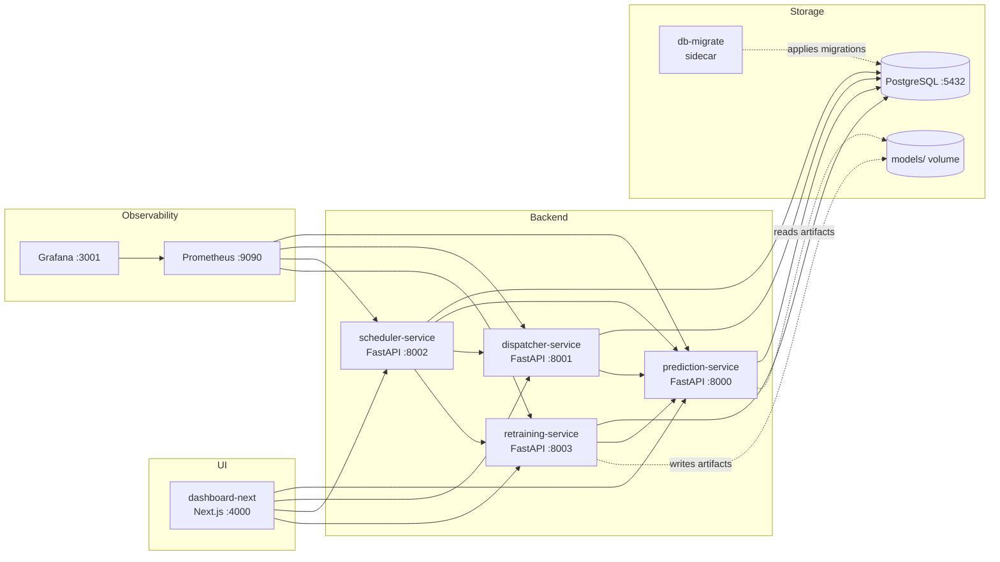

# WildHack: система автоматического вызова транспорта на склады

Прототип для командного трека WildHack / RWB, который закрывает полный контур принятия решения:

`история статусов товаров -> прогноз отгрузок -> расчет потребности в транспорте -> заявки на подачу машин -> backfill фактов -> контроль качества -> retraining`

Решение собрано как набор веб-сервисов с общей PostgreSQL, операторским dashboard и контуром MLOps. Репозиторий пригоден и для демонстрации жюри, и для локальной инженерной разработки.

## Зачем это нужно

Ошибка в вызове транспорта бьет по двум сторонам бизнеса одновременно:

- недовызов транспорта приводит к простоям склада, задержкам отгрузок и SLA-рискам;
- перевызов транспорта создает холостые рейсы и прямые операционные затраты.

Наша цель в прототипе: перейти от реактивной схемы вызова машин к проактивной, когда система каждые 30 минут пересчитывает ожидаемый объем отгрузок и автоматически формирует заявки на транспорт по складам.

## Что уже реализовано

### Сквозной продуктовый контур

1. `prediction-service` принимает актуальные `status_1..8` по маршрутам и прогнозирует `target_2h` на 10 шагов вперед.
2. `dispatcher-service` агрегирует прогнозы на уровень склада и рассчитывает количество машин.
3. `scheduler-service` по расписанию запускает `predict + dispatch`, считает качество и backfill'ит факты.
4. `retraining-service` переобучает модель, ведет реестр версий, поддерживает champion/challenger и shadow promotion.
5. `dashboard-next` дает оператору интерфейс для readiness-check, контроля прогнозов, заявок, качества, моделей и загрузки новых данных.

### Что особенно важно для защиты

- Есть **one-command demo-flow**: `make judge-up`.
- Есть **реальный runtime**, а не только ноутбук с моделью.
- Есть **бизнес-логика перехода от прогноза к заявке**, а не только inference.
- Есть **контур качества**: WAPE + |RBias|, бизнес-KPI, baseline, retraining.
- Есть **два сценария эксплуатации**: Docker demo и host-based local development.

## Соответствие требованиям трека

| Требование | Как закрыто в проекте |
| --- | --- |
| Предсказательная модель на тренировочных данных | LightGBM-модель в `models/model.pkl` и retraining pipeline в `services/retraining-service` |
| Веб-сервис или связка веб-сервисов | 4 FastAPI-сервиса + Next.js dashboard + PostgreSQL |
| Логика работы с прогнозом | Scheduler каждые 30 минут запускает полный цикл и сохраняет прогнозы/заявки в БД |
| Оценка качества | Онлайн `quality_check`, offline baseline, бизнес-KPI `order_accuracy` и `avg_truck_utilization` |
| Пути развития продукта | Описаны в разделе `Roadmap` |
| README с запуском и бизнес-допущениями | Этот файл + детальные документы в `docs/` |

## Архитектура



### Сервисы

| Компонент | Порт | Назначение |
| --- | --- | --- |
| `prediction-service` | 8000 | Инференс: прогноз `target_2h` по маршруту на 10 шагов x 30 минут |
| `dispatcher-service` | 8001 | Агрегация прогнозов по складам и расчет количества машин |
| `scheduler-service` | 8002 | Оркестрация predict/dispatch, backfill фактов, quality check |
| `retraining-service` | 8003 | Переобучение, baseline, реестр моделей, shadow/champion promotion |
| `dashboard-next` | 4000 | UI для жюри, оператора и команды |
| `postgres` | 5432 | История статусов, прогнозы, заявки, метрики, реестр моделей |
| `prometheus` | 9090 | Сбор техметрик сервисов |
| `grafana` | 3001 | Визуализация состояния стека |

## Логика работы с прогнозом

### Частота и горизонт

- входные данные приходят с шагом **30 минут**;
- scheduler пересчитывает прогноз и заявки **каждые 30 минут**;
- модель строит прогноз на **10 шагов вперед = 5 часов**;
- scheduler запрашивает dispatch в окне **до 6 часов**, но фактический прогнозный горизонт модели в прототипе составляет **5 часов**.

### Как именно мы используем прогноз

1. На уровне маршрута прогнозируем `target_2h`.
2. На уровне склада суммируем прогнозы всех маршрутов в одном временном слоте.
3. Добавляем буфер на неопределенность прогноза.
4. Переводим объем в количество машин по формуле.
5. Сохраняем заявку в `transport_requests`.

В текущем прототипе мы сохраняем полный 5-часовой план. С точки зрения операционного использования рекомендуем делить его на две зоны:

- **0-2 часа**: commit zone, по ней можно автоматически вызывать транспорт;
- **2-5 часов**: readiness zone, по ней имеет смысл готовить транспорт и подтверждать решение на следующем цикле.

### Какие преобразования данных используются

- lag-фичи по `status_1..8` и `target_2h`;
- diff-фичи по статусам и inventory-признакам;
- rolling mean / rolling sum;
- статические профили маршрутов и складов из `static_aggs.json`;
- fill-values из `fill_values.json`;
- cold-start fallback через среднюю историю по складу;
- snap к каноническим 30-минутным слотам;
- backfill фактических `target_2h` и фактических параметров заявок.

## Предиктивная модель

### Текущий production-compatible артефакт

В репозитории уже лежит совместимая с runtime модель:

- файл: `models/model.pkl`
- metadata: `models/model_metadata.json`
- версия: `v20260408_051606`

Метрики этого артефакта по metadata:

| Параметр | Значение |
| --- | --- |
| Алгоритм | LightGBM Regressor |
| Objective | `regression_l1` |
| Combined score | `0.008289` |
| WAPE | `0.00808` |
| RBias | `0.00021` |
| Число признаков | `312` |
| Train rows | `1,431,000` |
| Validation rows | `10,000` |
| Training window | `30` дней |

### Почему LightGBM

- хорошо работает на табличных временных данных после feature engineering;
- быстрый inference для онлайнового сервиса;
- легко переобучается и деплоится;
- прозрачно сравнивается с baseline.

### Baseline

В `retraining-service` встроен честный baseline для сравнения:

- модель: среднее `target_2h` по `(route_id, hour_of_day, day_of_week)`;
- реализация: `services/retraining-service/app/core/baseline.py`;
- baseline считается на том же out-of-time split, что и LightGBM.

Это важно для защиты: мы сравниваем сложную модель не "с пустотой", а с понятным сезонным ориентиром.

## Бизнес-логика вызова транспорта

### Формула

```text
trucks = max(min_trucks, ceil(total_containers * (1 + buffer_pct) / truck_capacity))
```

Где:

- `total_containers` — суммарный прогноз отгрузки по складу на слот;
- `buffer_pct` — запас на ошибку модели;
- `truck_capacity` — вместимость одной машины;
- `min_trucks` — минимальное число машин при ненулевом прогнозе.

### Пример

- прогноз по складу на слот: `80` емкостей;
- буфер: `10%`;
- вместимость машины: `33`;
- расчет: `ceil(80 * 1.10 / 33) = ceil(2.67) = 3`.

### Бизнес-допущения

| Допущение | Как зафиксировано |
| --- | --- |
| Все машины одинаковой вместимости | `TRUCK_CAPACITY=33` по умолчанию |
| Транспорт вызывается на уровне склада | Маршруты агрегируются в `office_from_id` |
| При ненулевом прогнозе нужна минимум 1 машина | `MIN_TRUCKS=1` |
| Буфер нужен всегда | `BUFFER_PCT=0.10` или adaptive buffer |
| Привязка маршрута к складу не меняется | Используется как базовое свойство данных |
| Полный автоплан строится на 5 часов | Совпадает с горизонтом прогноза |

### Что происходит после принятия решения

- заявка пишется в `transport_requests`;
- позже scheduler backfill'ит `actual_vehicles` и `actual_units`;
- после этого становятся доступны бизнес-KPI по фактическому исполнению.

## Контур качества

### ML-метрики

Основная метрика и для соревнования, и для online quality checker:

```text
WAPE  = sum(|y_pred - y_true|) / sum(y_true)
RBias = abs(sum(y_pred) / sum(y_true) - 1)
Score = WAPE + RBias
```

### Бизнес-метрики

Система считает и отдает через API:

- `order_accuracy` — доля слотов, где `|predicted_vehicles - actual_vehicles| <= 2`;
- `avg_truck_utilization` — средняя загрузка машин `actual_units / (vehicles * capacity)`.

### Автоматический контроль качества

`scheduler-service` раз в час:

- сопоставляет прогнозы и факты;
- сохраняет качество в `prediction_quality`;
- поднимает алерты при деградации;
- отслеживает победы shadow-модели;
- автоматически промоутит shadow в primary после `3` подряд побед.

## Dashboard

Dashboard нужен не только для красивой демо-картинки, а как операторский BFF над сервисами.

| Страница | Что показывает |
| --- | --- |
| `Readiness` | health-check сервисов и наполненность ключевых таблиц |
| `Overview` | сводные KPI и состояние складов |
| `Forecasts` | прогнозы по складам и маршрутам |
| `Dispatch` | сформированные заявки на транспорт |
| `Quality` | качество модели и бизнес-KPI |
| `Data` | загрузка снапшота истории и Team Track test flow |
| `Models` | реестр моделей, retrain, shadow, champion |
| `Operations` | pipeline history, quality alerts, ручные триггеры |

## API: основные контракты

Полный справочник лежит в `docs/api-reference.md`. Ниже только ключевая поверхность.

| Сервис | Эндпоинты |
| --- | --- |
| `prediction-service` | `POST /predict`, `POST /predict/batch`, `GET /model/info`, `POST /model/reload`, `POST /model/shadow/load` |
| `dispatcher-service` | `POST /dispatch`, `GET /dispatch/schedule`, `GET /warehouses`, `GET /api/v1/transport-requests`, `GET /api/v1/metrics/business` |
| `scheduler-service` | `GET /pipeline/status`, `POST /pipeline/trigger`, `GET /pipeline/history`, `POST /quality/trigger`, `GET /quality/alerts` |
| `retraining-service` | `POST /retrain`, `GET /models`, `GET /models/champion`, `POST /models/{version}/shadow`, `POST /models/{version}/promote` |

### Дополнительные важные возможности

- `POST /upload-dataset` — загружает новый history snapshot как authoritative state;
- `POST /team-track/preview` — проверка Team Track test template;
- `POST /team-track/submission` — генерация submission CSV по выбранной версии модели.

## Данные и хранилище

### Основные таблицы PostgreSQL

| Таблица | Назначение |
| --- | --- |
| `route_status_history` | История `status_1..8` и `target_2h` |
| `forecasts` | Сохраненные прогнозы primary и shadow |
| `transport_requests` | Заявки на транспорт и фактическое исполнение |
| `routes`, `warehouses` | Справочники |
| `model_metadata` | Реестр версий моделей |
| `pipeline_runs` | История запусков scheduler |
| `prediction_quality` | История WAPE / RBias / combined score |
| `retrain_history` | История retraining запусков |

### Откуда берутся данные для демо

Judge-flow использует `Data/raw/train_team_track.parquet`:

- если БД пустая, данные автоматически загружаются;
- затем запускаются 5 non-overlapping historical replay cycles на канонической сетке `:00/:30`;
- после них одним проходом backfill'ятся `target_2h` и `transport_requests.actual_*`;
- затем запускается текущий `predict + dispatch`;
- в результате dashboard сразу непустой и пригоден для демонстрации.

## Запуск

### Вариант 1: режим для жюри / демо

Самый полезный сценарий для быстрой проверки:

```bash
git clone https://github.com/kxddry/WildHack
cd WildHack
make judge-up
```

Что делает `make judge-up`:

1. поднимает весь Docker-стек;
2. автоматически создает `.env` из шаблона, если его нет;
3. проверяет health всех сервисов;
4. при пустой БД загружает demo snapshot;
5. прогоняет 5 historical replay anchors oldest→newest с шагом 5 часов, затем backfill actuals;
6. запускает current pipeline для свежих planned/dispatched слотов;
7. печатает URL сервисов.

Полезные команды:

```bash
make judge-status
make judge-down
make judge-fresh
```

### Вариант 2: обычный Docker Compose

```bash
cp .env.example .env
docker compose -f infrastructure/docker-compose.yml up --build
```

Минимум, что стоит проверить в `.env` перед первым запуском:

- `DATA_INGEST_TOKEN`
- `INTERNAL_API_TOKEN`

Для локального ноутбука можно оставить demo-значения из шаблона, но для любого общего окружения токены нужно заменить.

Поведение `prediction-service` при старте:

- по умолчанию сервис работает в **fail-fast** режиме и требует `models/model.pkl`, `models/static_aggs.json`, `models/fill_values.json`;
- если артефактов нет, можно включить локальный fallback через `MOCK_MODE=1`, но этот режим предназначен только для разработки.

### Вариант 3: локальная разработка на хосте

```bash
make setup
make db-init
make up
```

Плюсы host-mode:

- быстрый reload Python-сервисов;
- удобная отладка;
- не нужно пересобирать образы после каждой правки.

Полезные команды:

```bash
make status
make logs
make down
make e2e
make e2e-smoke
make e2e-dashboard
```

## Доступные URL

| Сервис | URL |
| --- | --- |
| Dashboard | http://localhost:4000 |
| Prediction Swagger | http://localhost:8000/docs |
| Dispatcher Swagger | http://localhost:8001/docs |
| Scheduler Swagger | http://localhost:8002/docs |
| Retraining Swagger | http://localhost:8003/docs |
| Prometheus | http://localhost:9090 |
| Grafana | http://localhost:3001 |

## Тестирование

В репозитории есть несколько уровней тестов:

- unit-тесты по сервисам;
- интеграционные тесты;
- smoke e2e;
- browser e2e для dashboard на Playwright.

Быстрые команды:

```bash
make e2e
make e2e-smoke
make e2e-dashboard
```

## Структура репозитория

```text
services/
  prediction-service/   FastAPI inference API
  dispatcher-service/   FastAPI transport planner
  scheduler-service/    FastAPI + APScheduler orchestration
  retraining-service/   FastAPI retrain + model registry + team track
  dashboard-next/       Next.js operator UI
infrastructure/
  docker-compose.yml
  postgres/
  prometheus/
  grafana/
scripts/
  judge/                one-command demo flow
  local/                host-based dev workflow
models/                 runtime model artifacts
docs/                   detailed architecture / business / deployment docs
tests/                  e2e and integration tests
final_submissions/      offline training artifacts and submissions
```

## Product roadmap

Следующие шаги для развития решения:

1. **Гетерогенный транспорт**  
   Вместо одной вместимости машины перейти к нескольким типам ТС и оптимизации под mix флота.

2. **Cost-aware dispatching**  
   Заменить формулу `ceil` на оптимизацию с учетом стоимости недовызова, холостого рейса и SLA.

3. **Больше внешних признаков**  
   Добавить календарь акций, выходные, погоду, дорожную ситуацию, ETA, тип склада и сезонность по регионам.

4. **Event-driven ingestion**  
   Перейти от snapshot ingestion к потоковой схеме через Kafka / NATS / CDC.

5. **Канареечный rollout по складам**  
   Включать auto-dispatch сначала на части складов и сравнивать с контрольной группой.

6. **Замкнутый feedback-loop**  
   Учитывать фактические отклонения заявок при расчете буфера на уровне конкретного склада и часа суток.

## Детальная документация

- `docs/architecture.md` — архитектура по сервисам и инфраструктуре
- `docs/business-logic.md` — доменная модель, допущения и алгоритм диспатчинга
- `docs/api-reference.md` — API-контракты и примеры запросов
- `docs/deployment.md` — развертывание и переменные окружения
- `docs/PRD_WildHack_Logistics.md` — продуктовая постановка

## Итог

Этот репозиторий описывает не просто модель прогноза, а полноценный прототип системы принятия логистических решений:

- он умеет прогнозировать отгрузки;
- переводит прогноз в заявки на транспорт;
- измеряет качество решения;
- поддерживает операционную эксплуатацию;
- готов к демонстрации и дальнейшему развитию в production.
