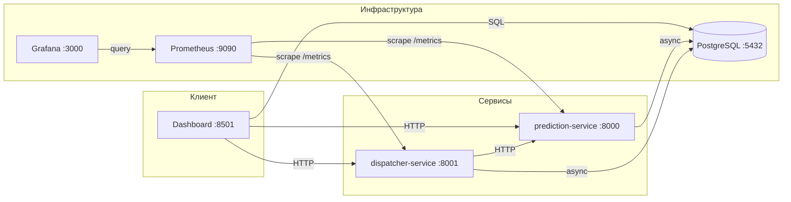

# WildHack: Система автоматического вызова транспорта

## Описание

Прототип системы автоматического вызова транспорта на склады на основе прогноза отгрузок. Система решает задачу перехода от прогноза объёмов отгрузок к принятию операционных решений — расчёту необходимого количества транспорта и формированию заявок.

**Ключевая идея:** статусные данные обработки товаров (status_1..8) поступают на вход предсказательной модели, которая прогнозирует объём отгрузок (target_2h) на 5 часов вперёд. Диспатчер-сервис агрегирует прогнозы по складам и рассчитывает необходимое количество машин.

## Архитектура



### Компоненты

| Сервис | Порт | Технология | Описание |
|--------|------|------------|----------|
| prediction-service | 8000 | FastAPI | Прогнозирование спроса (LightGBM) |
| dispatcher-service | 8001 | FastAPI | Расчёт количества транспорта |
| dashboard | 8501 | Streamlit | Визуализация и мониторинг |
| PostgreSQL | 5432 | PostgreSQL 16 | Хранение данных |
| Prometheus | 9090 | Prometheus | Сбор метрик сервисов |
| Grafana | 3000 | Grafana | Визуализация метрик |

## Быстрый старт

### Требования

- Docker и Docker Compose
- 4 GB RAM
- Обученная модель `models/model.pkl` (LightGBM)

### Запуск

```bash
# Клонирование репозитория
git clone <repo-url> && cd WildHack

# Запуск всех сервисов
cd infrastructure
docker-compose up --build
```

### Доступ к сервисам

| Сервис | URL |
|--------|-----|
| Dashboard | http://localhost:8501 |
| Prediction API (Swagger) | http://localhost:8000/docs |
| Dispatcher API (Swagger) | http://localhost:8001/docs |
| Grafana | http://localhost:3000 (логин: admin / admin) |
| Prometheus | http://localhost:9090 |

### Заполнение данными

```bash
# Загрузка исторических данных статусов (необходимо для feature engineering)
python scripts/seed_status_history.py

# Загрузка демо-данных (прогнозы + заявки на транспорт)
python scripts/seed_demo_data.py
```

## Бизнес-логика

### Прогнозная модель

- **Алгоритм:** LightGBM Regressor (MAE / regression_l1 objective)
- **Целевая переменная:** `target_2h` — количество ёмкостей, отгруженных по маршруту за последние 2 часа
- **Горизонт прогноза:** 10 шагов x 30 минут = 5 часов вперёд
- **Признаки:** lag-фичи, скользящие средние, разности (diff) по статусам status_1..8
- **Окно обучения:** 7 дней исторических данных (288 наблюдений по 30 минут)
- **CV Score:** 0.292 (WAPE + |Relative Bias|)

### Алгоритм диспатчинга

1. **Агрегация прогнозов** — суммирование прогнозов по всем маршрутам склада для каждого временного слота
2. **Расчёт количества машин:**

```
trucks = ceil(total_containers * (1 + buffer_pct) / truck_capacity)
```

3. **Формирование заявок** — генерация транспортных заявок с указанием времени подачи, склада и количества машин

**Пример расчёта:**
- Прогноз: 80 ёмкостей на склад за 2-часовой слот
- Буфер: 10% -> 80 * 1.10 = 88 ёмкостей с буфером
- Вместимость машины: 33 ёмкости
- Результат: ceil(88 / 33) = **3 машины**

### Бизнес-допущения

| # | Допущение | Обоснование |
|---|-----------|-------------|
| 1 | Все машины одинаковой вместимости | Настраиваемый параметр (`TRUCK_CAPACITY`, по умолчанию 33 ёмкости). В реальности можно расширить до гетерогенного транспорта |
| 2 | Транспорт вызывается на уровне склада | Маршруты агрегируются до уровня склада (office_from_id). Логистически транспорт подаётся на склад, а не на отдельный маршрут |
| 3 | Буфер 10% для неточности прогноза | Компенсирует ошибку модели. Настраиваемый параметр (`BUFFER_PCT`) |
| 4 | Горизонт планирования — 5 часов | 10 шагов x 30 минут. Достаточно для заблаговременного вызова транспорта |
| 5 | Один маршрут привязан к одному складу | Связь многие-к-одному (route -> warehouse), подтверждено организаторами |
| 6 | Минимум 1 машина при ненулевом прогнозе | Если есть прогнозируемый объём, отправляется минимум одна машина (`MIN_TRUCKS=1`) |

## API

### Prediction Service (:8000)

| Метод | Эндпоинт | Описание |
|-------|----------|----------|
| POST | `/predict` | Прогноз для одного маршрута (10 шагов) |
| POST | `/predict/batch` | Пакетный прогноз для нескольких маршрутов |
| GET | `/model/info` | Метаданные модели (тип, CV score, признаки) |
| GET | `/health` | Проверка здоровья сервиса |
| GET | `/metrics` | Prometheus-метрики |

### Dispatcher Service (:8001)

| Метод | Эндпоинт | Описание |
|-------|----------|----------|
| POST | `/dispatch` | Расчёт транспорта для склада |
| GET | `/dispatch/schedule` | Расписание диспатчинга на 5 часов |
| GET | `/warehouses` | Список складов с текущей нагрузкой |
| GET | `/health` | Проверка здоровья сервиса |
| GET | `/metrics` | Prometheus-метрики |

Полная документация API с примерами: [docs/api-reference.md](docs/api-reference.md)

## Оценка качества

### Метрика соревнования

**WAPE + |Relative Bias|**

```
WAPE = sum(|y_pred - y_true|) / sum(y_true)
Relative Bias = |sum(y_pred) / sum(y_true) - 1|
```

### Мониторинг

- **Prometheus** собирает метрики latency, throughput и ошибок с обоих сервисов (интервал 15 секунд)
- **Grafana** визуализирует метрики в реальном времени
- **Dashboard** отображает историческую точность прогнозов vs фактические значения

## Пути развития

1. **Асинхронная обработка:** Redis Pub/Sub для отвязки prediction-service от dispatcher-service
2. **Оптимизация загрузки:** группировка совместимых маршрутов для максимальной загрузки машин
3. **Гетерогенный транспорт:** различные типы и вместимости машин с оптимизацией распределения
4. **Дополнительные признаки:** погода, праздники, промо-акции, день недели
5. **A/B тестирование моделей:** сравнение разных подходов (LightGBM vs CatBoost vs ансамбли) в production
6. **Автоматическое дообучение:** периодическое обновление модели на свежих данных

## Технологии

| Категория | Технология |
|-----------|------------|
| Язык | Python 3.11 |
| API-фреймворк | FastAPI |
| ML-модель | LightGBM |
| Dashboard | Streamlit |
| База данных | PostgreSQL 16 |
| Контейнеризация | Docker, Docker Compose |
| Мониторинг | Prometheus, Grafana |
| Метрики API | prometheus-fastapi-instrumentator |
| Валидация | Pydantic v2, pydantic-settings |

## Тесты

```bash
# Unit-тесты prediction-service
cd services/prediction-service && pytest tests/ -v

# Unit-тесты dispatcher-service
cd services/dispatcher-service && pytest tests/ -v
```

## Структура проекта

```
WildHack/
├── README.md                          # Этот файл
├── docs/
│   ├── architecture.md                # Архитектура системы
│   ├── business-logic.md              # Бизнес-логика и допущения
│   ├── api-reference.md               # Справочник API
│   └── deployment.md                  # Руководство по развёртыванию
├── services/
│   ├── prediction-service/            # Сервис прогнозирования
│   │   ├── app/
│   │   │   ├── api/                   # Эндпоинты и схемы
│   │   │   ├── core/                  # Модель и feature engineering
│   │   │   └── storage/               # Работа с PostgreSQL
│   │   ├── tests/
│   │   ├── Dockerfile
│   │   └── requirements.txt
│   ├── dispatcher-service/            # Сервис диспатчинга
│   │   ├── app/
│   │   │   ├── api/                   # Эндпоинты и схемы
│   │   │   ├── core/                  # Алгоритм расчёта транспорта
│   │   │   └── storage/               # Работа с PostgreSQL
│   │   ├── tests/
│   │   ├── Dockerfile
│   │   └── requirements.txt
│   └── dashboard/                     # Streamlit-дашборд
│       ├── app/
│       │   ├── components/            # Графики, метрики, таблицы
│       │   ├── data/                  # API и DB клиенты
│       │   └── pages/                 # Страницы дашборда
│       ├── Dockerfile
│       └── requirements.txt
├── infrastructure/
│   ├── docker-compose.yml             # Оркестрация всех сервисов
│   ├── postgres/
│   │   └── init.sql                   # Схема базы данных
│   ├── prometheus/
│   │   └── prometheus.yml             # Конфигурация Prometheus
│   └── grafana/                       # Конфигурация Grafana
├── models/                            # Обученные модели (.pkl)
├── experiments/                       # Эксперименты и обучение
│   └── core/                          # Переиспользуемые модули
├── scripts/
│   ├── seed_status_history.py         # Загрузка исторических данных
│   └── seed_demo_data.py              # Загрузка демо-данных
└── .env.example                       # Шаблон переменных окружения
```
