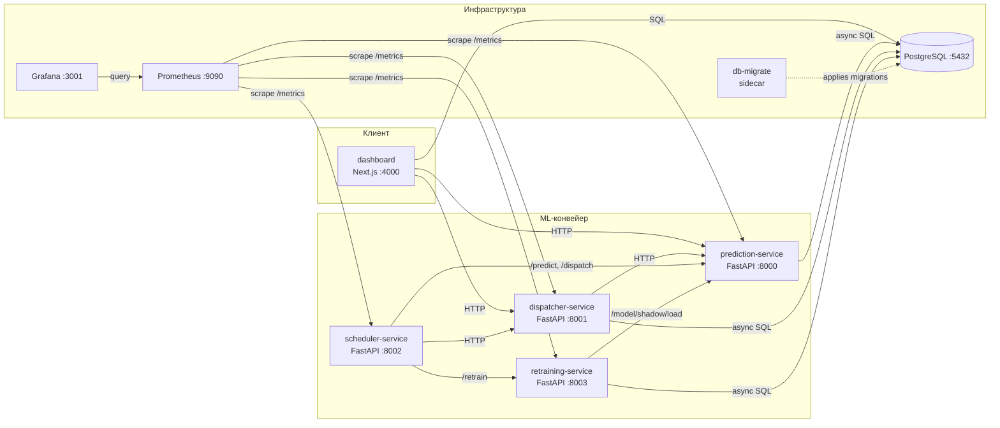

# WildHack: Система автоматического вызова транспорта

## Описание

Прототип системы автоматического вызова транспорта на склады на основе прогноза отгрузок. Решает задачу перехода от прогноза объёмов отгрузок к принятию операционных решений — расчёту необходимого количества транспорта и формированию заявок.

**Ключевая идея:** статусные данные обработки товаров (`status_1..8`) поступают на вход предсказательной модели LightGBM, которая прогнозирует объём отгрузок (`target_2h`) на 5 часов вперёд. Диспатчер агрегирует прогнозы по складам и рассчитывает количество машин. Шедулер периодически прогоняет конвейер, контролирует качество и инициирует переобучение, а сервис ретрейнинга по champion/challenger-схеме обновляет модель в production.

## Архитектура



### Компоненты

| Сервис | Порт | Технология | Назначение |
|--------|------|------------|------------|
| `prediction-service` | 8000 | FastAPI + LightGBM | Прогноз отгрузок (`target_2h`) на 10 шагов × 30 мин |
| `dispatcher-service` | 8001 | FastAPI | Агрегация прогнозов и расчёт количества машин |
| `scheduler-service` | 8002 | FastAPI + APScheduler | Периодический запуск predict/dispatch, контроль качества, backfill `target_2h` |
| `retraining-service` | 8003 | FastAPI + LightGBM | Champion/challenger-переобучение, реестр моделей |
| `dashboard` | 4000 | Next.js 16 + React 19 | Operator UI: Overview / Forecasts / Dispatch / Quality / Readiness |
| `postgres` | 5432 | PostgreSQL 16 | Единое хранилище данных |
| `db-migrate` | — | postgres:16-alpine | One-shot sidecar: применяет идемпотентные миграции из `infrastructure/postgres/migrations/` |
| `prometheus` | 9090 | Prometheus | Сбор метрик со всех сервисов |
| `grafana` | 3001 | Grafana | Визуализация метрик (порт по умолчанию `3001`, чтобы не конфликтовать с локальным `next dev` на `3000`) |

## Быстрый старт

### Требования

- Docker 20.10+ и Docker Compose v2
- ~4 GB RAM
- Артефакты модели в `models/`: `model.pkl`, `static_aggs.json`, `fill_values.json` (либо `MOCK_MODE=1` для синтетического fallback в локальной разработке)

### Запуск

```bash
# 1. Клонирование
git clone https://github.com/kxddry/WildHack && cd WildHack

# 2. Опционально: настройка переменных окружения
cp .env.example .env   # отредактируйте при необходимости

# 3. Запуск всего стека
docker compose -f infrastructure/docker-compose.yml up --build
```

Первый запуск занимает 2–5 минут (сборка образов). `db-migrate` отрабатывает после готовности PostgreSQL и применяет SQL-миграции из `infrastructure/postgres/migrations/`. Остальные сервисы стартуют после успешного завершения миграций.

### Доступ к сервисам

| Сервис | URL |
|--------|-----|
| Dashboard | http://localhost:4000 |
| Prediction API (Swagger) | http://localhost:8000/docs |
| Dispatcher API (Swagger) | http://localhost:8001/docs |
| Scheduler API (Swagger) | http://localhost:8002/docs |
| Retraining API (Swagger) | http://localhost:8003/docs |
| Prometheus | http://localhost:9090 |
| Grafana | http://localhost:3001 (логин `admin` / `admin`, анонимный доступ выключен по умолчанию) |

### Демо-режим без модели (`MOCK_MODE`)

`prediction-service` по умолчанию **fail-fast** падает при старте, если отсутствует хотя бы один из артефактов (`model.pkl`, `static_aggs.json`, `fill_values.json`). Это сделано намеренно, чтобы ни одно окружение не «молчком» отдавало синтетические прогнозы за реальные.

Для локальной разработки можно включить детерминированный синтетический fallback:

```bash
MOCK_MODE=1 docker compose -f infrastructure/docker-compose.yml up --build prediction-service
```

В этом режиме `/health` возвращает `status: "mock"`, а в логах будет заметное предупреждение.

## Бизнес-логика

### Прогнозная модель

- **Алгоритм:** LightGBM Regressor (objective `regression_l1`, MAE)
- **Целевая переменная:** `target_2h` — количество ёмкостей, отгруженных по маршруту за последние 2 часа
- **Горизонт:** 10 шагов × 30 минут = 5 часов вперёд
- **Признаки:** lag-фичи, скользящие средние, разности (diff) по `status_1..8`, статические агрегаты (`static_aggs.json`) и медианные fill-значения (`fill_values.json`) из обучающей выборки
- **Окно истории для inference:** 288 наблюдений (≈6 дней) из таблицы `route_status_history`
- **Cold-start fallback:** при <24 наблюдениях (12 часов) используется среднее по складу
- **Shadow-модель:** опционально загружается параллельно с primary; её прогнозы сохраняются в `forecasts` с отдельной `model_version` для A/B-сравнения

### Алгоритм диспатчинга

1. **Агрегация прогнозов** — суммирование `predicted_value` по всем маршрутам склада в каждом временном слоте
2. **Расчёт количества машин:**

```
trucks = max(min_trucks, ceil(total_containers * (1 + buffer_pct) / truck_capacity))
```

3. **Формирование заявок** в `transport_requests` со строкой `calculation`, фиксирующей формулу

**Пример:**
- Прогноз: 80 ёмкостей на склад за слот
- Буфер 10% → 88 ёмкостей
- Вместимость машины: 33
- Результат: `ceil(88 / 33) = 3` машины

Поддерживается опциональный **adaptive buffer** (`ADAPTIVE_BUFFER=true`), который масштабирует буфер между `MIN_BUFFER_PCT` и `MAX_BUFFER_PCT` в зависимости от неопределённости прогноза.

### Бизнес-допущения

| # | Допущение | Обоснование |
|---|-----------|-------------|
| 1 | Все машины одной вместимости | Параметр `TRUCK_CAPACITY` (33 ёмкости по умолчанию). Расширяется до гетерогенного транспорта |
| 2 | Транспорт вызывается на уровне склада | Маршруты агрегируются до `office_from_id` — машина приезжает на склад, не на маршрут |
| 3 | Буфер 10% (или адаптивный) | Компенсирует ошибку модели; задаётся `BUFFER_PCT` / `ADAPTIVE_BUFFER` |
| 4 | Горизонт планирования — 5 часов | 10 шагов × 30 мин — достаточно для заблаговременной подачи транспорта |
| 5 | Один маршрут — один склад | Привязка `route → warehouse` фиксированная (подтверждено организаторами) |
| 6 | Минимум `MIN_TRUCKS` при ненулевом прогнозе | По умолчанию 1: лучше отправить лишнюю машину, чем оставить склад без транспорта |

## API

### Prediction Service (:8000)

| Метод | Эндпоинт | Назначение |
|-------|----------|-----------|
| POST | `/predict` | Прогноз для одного маршрута (10 шагов) |
| POST | `/predict/batch` | Параллельный пакетный прогноз (semaphore = 10) |
| GET | `/model/info` | Метаданные модели |
| POST | `/model/reload` | Hot-reload primary-модели с диска |
| POST | `/model/reload-features` | Перечитать `static_aggs.json` / `fill_values.json` |
| POST | `/model/shadow/load` | Загрузить shadow-модель для A/B (`?path=...`) |
| POST | `/model/shadow/promote` | Промоутить shadow → primary |
| DELETE | `/model/shadow` | Снять shadow-модель |
| GET | `/health` | `healthy` / `mock` / `degraded` |
| GET | `/metrics` | Prometheus-метрики |

Все эндпоинты доступны и под префиксом `/api/v1/...` (PRD §6).

### Dispatcher Service (:8001)

| Метод | Эндпоинт | Назначение |
|-------|----------|-----------|
| POST | `/dispatch` | Расчёт транспорта для склада (forecasts inline или из БД) |
| GET | `/dispatch/schedule?warehouse_id=` | Сохранённое расписание заявок |
| GET | `/warehouses` | Список складов с агрегатами |
| GET | `/api/v1/transport-requests?office_id=&from=&to=` | PRD §6.2 — заявки по складу за окно |
| GET | `/api/v1/metrics/business?from=&to=` | PRD §9.2 — `order_accuracy` и `avg_truck_utilization` |
| GET | `/health` | Health-check |
| GET | `/metrics` | Prometheus-метрики |

### Scheduler Service (:8002)

| Метод | Эндпоинт | Назначение |
|-------|----------|-----------|
| GET | `/pipeline/status` | Текущий статус оркестратора и quality checker |
| POST | `/pipeline/trigger` | Ручной запуск цикла predict + dispatch |
| GET | `/pipeline/history?limit=` | Аудит-лог запусков из `pipeline_runs` |
| POST | `/quality/trigger` | Внеочередной расчёт качества |
| GET | `/quality/alerts` | Активные алерты по дрейфу качества |
| GET | `/health` | Health-check |

Внутри Scheduler работают три APScheduler-задачи:
- **prediction_cycle** — каждые `PREDICTION_INTERVAL_MINUTES` (по умолчанию 30 мин)
- **quality_check** — каждые `QUALITY_CHECK_INTERVAL_MINUTES` (по умолчанию 60 мин); промоутит shadow → primary после `SHADOW_PROMOTE_STREAK_THRESHOLD` (3) подряд побед
- **backfill_target_2h** — каждые 30 мин, дописывает фактический `target_2h` в `route_status_history` и `transport_requests.actual_*`

### Retraining Service (:8003)

| Метод | Эндпоинт | Назначение |
|-------|----------|-----------|
| POST | `/retrain` | Полный цикл: fetch → features → train → eval → register → (shadow promote) |
| GET | `/retrain/status` | Результат последнего запуска |
| GET | `/models` | Реестр всех версий из `model_metadata` |
| GET | `/models/champion` | Текущий champion (наименьший `cv_score`) |
| POST | `/models/{version}/shadow` | Загрузить версию как shadow в prediction-service |
| POST | `/models/{version}/promote` | Промоутить версию в primary |
| GET | `/health` | Health-check |

Полный справочник API с примерами запросов: [docs/api-reference.md](docs/api-reference.md).

## База данных

Схема создаётся `infrastructure/postgres/init.sql` при первом запуске и расширяется идемпотентными миграциями из `infrastructure/postgres/migrations/` (применяются sidecar-сервисом `db-migrate` на каждом `compose up`).

| Таблица | Назначение |
|---------|-----------|
| `route_status_history` | История наблюдений `status_1..8` + `target_2h` (источник для feature engineering) |
| `forecasts` | Сохранённые прогнозы (primary и shadow) |
| `transport_requests` | Заявки на транспорт + `actual_vehicles` / `actual_units` для KPI |
| `routes`, `warehouses` | Справочники маршрутов и складов |
| `model_metadata` | Реестр обученных моделей (champion/challenger) |
| `pipeline_runs` | Аудит-лог запусков scheduler |
| `prediction_quality` | История WAPE / RBias / combined_score |
| `retrain_history` | Аудит-лог переобучений |

## Мониторинг и качество

### Метрика модели

**WAPE + |Relative Bias|** (используется и в соревновании, и онлайн `quality_check`):

```
WAPE  = sum(|y_pred - y_true|) / sum(y_true)
RBias = |sum(y_pred) / sum(y_true) - 1|
score = WAPE + RBias
```

### Бизнес-KPI (PRD §9.2)

- `order_accuracy` — доля слотов, где `|predicted_vehicles - actual_vehicles| ≤ 1`
- `avg_truck_utilization` — среднее `actual_units / (vehicles * capacity)` по выполненным слотам

Доступны через `GET /api/v1/metrics/business` и страницу **Quality** в дашборде.

### Prometheus / Grafana

- Prometheus собирает HTTP-метрики со всех четырёх FastAPI-сервисов через `/metrics` (`prometheus-fastapi-instrumentator`)
- Grafana подгружает дашборды и datasources из `infrastructure/grafana/provisioning/`

## Структура проекта

```
WildHack/
├── README.md                           # Этот файл
├── .env.example                        # Шаблон переменных окружения
├── docs/
│   ├── architecture.md                 # Архитектура системы
│   ├── business-logic.md               # Бизнес-логика и допущения
│   ├── api-reference.md                # Справочник API
│   ├── deployment.md                   # Руководство по развёртыванию
│   └── PRD_WildHack_Logistics.md       # Product Requirements Document
├── services/
│   ├── prediction-service/             # FastAPI + LightGBM, prediction + shadow
│   ├── dispatcher-service/             # FastAPI, расчёт транспорта + PRD v1 API
│   ├── scheduler-service/              # FastAPI + APScheduler, оркестратор
│   ├── retraining-service/             # FastAPI + LightGBM, champion/challenger
│   └── dashboard-next/                 # Next.js 16 + React 19 dashboard
├── infrastructure/
│   ├── docker-compose.yml              # Оркестрация всех сервисов
│   ├── postgres/
│   │   ├── init.sql                    # Базовая схема (создаётся при первом запуске)
│   │   └── migrations/                 # Идемпотентные SQL-миграции (применяет db-migrate)
│   ├── prometheus/prometheus.yml       # Targets для всех сервисов
│   └── grafana/                        # Provisioning: datasources + dashboards
├── models/                             # Артефакты модели (model.pkl, static_aggs.json, fill_values.json, shadow_model.pkl)
├── experiments/                        # Эксперименты, обучение, переиспользуемые модули
├── scripts/                            # Утилиты для подготовки и сидинга данных
└── tests/                              # Smoke- и e2e-тесты на уровне всего стека
```

## Технологии

| Категория | Технология |
|-----------|------------|
| Backend | Python 3.11, FastAPI, Pydantic v2, pydantic-settings, asyncpg / SQLAlchemy async |
| Шедулинг | APScheduler |
| ML | LightGBM, scikit-learn, pandas, numpy |
| Frontend | Next.js 16, React 19, TypeScript 5, Tailwind CSS 4, Recharts, Radix UI, lucide-react |
| База данных | PostgreSQL 16 |
| Контейнеризация | Docker, Docker Compose v2 |
| Мониторинг | Prometheus, Grafana, prometheus-fastapi-instrumentator |

## Тесты

```bash
# Unit / integration тесты по сервисам
cd services/prediction-service && pytest tests/ -v
cd services/dispatcher-service && pytest tests/ -v
cd services/retraining-service && pytest tests/ -v

# E2E smoke тесты на поднятый стек (требуют запущенный compose)
pytest tests/e2e/ -v
```

## Пути развития

1. **Асинхронная шина событий** — Redis Streams / NATS для отвязки prediction → dispatcher → dashboard
2. **Гетерогенный транспорт** — несколько типов машин с разной вместимостью + bin-packing
3. **Дополнительные признаки** — погода, праздники, промо-акции, день недели
4. **Расширение champion/challenger** — несколько одновременных shadow-моделей и многокритериальное сравнение
5. **Партиционирование `route_status_history`** по `warehouse_id` или времени при росте объёма данных
6. **CI/CD с автопромоутом** — пайплайн обучения → тест → канареечный shadow → автоматический промоут по KPI
