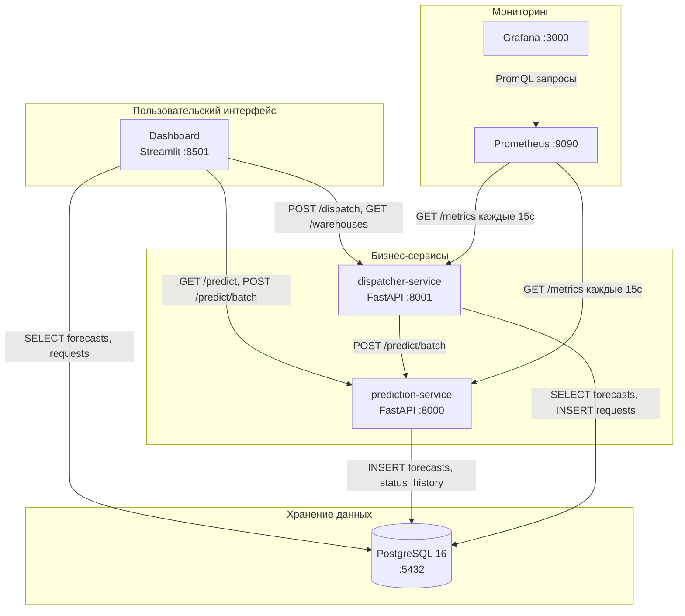
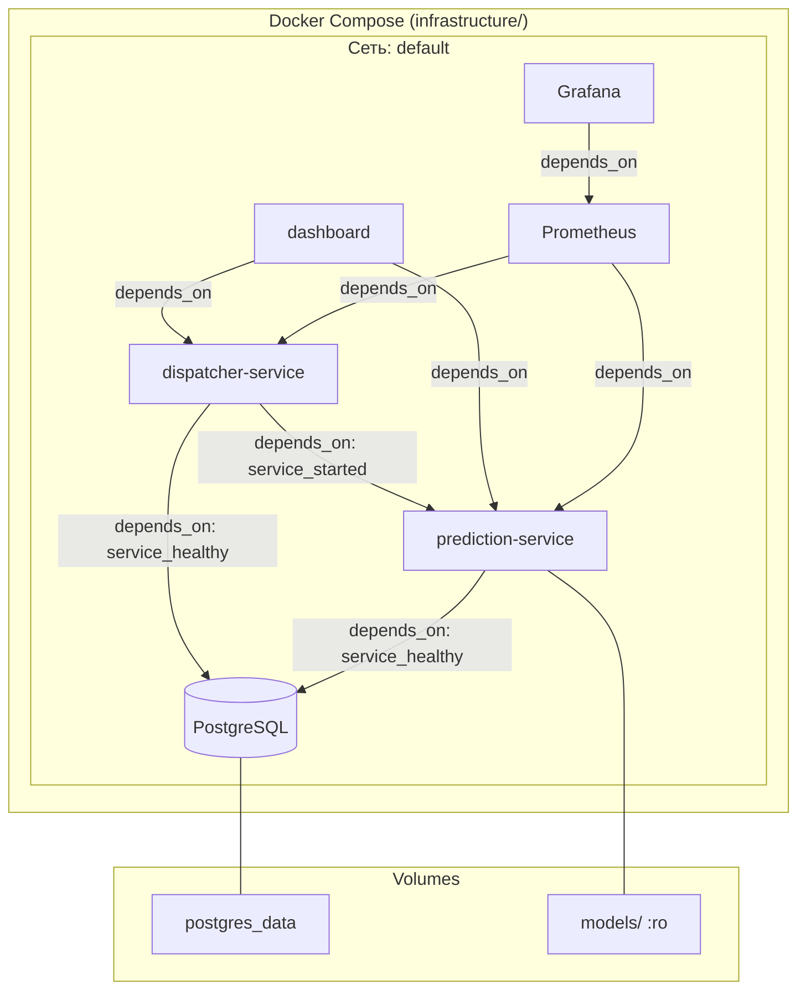

# Архитектура системы

## Обзор

Система автоматического вызова транспорта построена как набор слабо связанных микросервисов, взаимодействующих через HTTP API и общую базу данных PostgreSQL. Такой подход обеспечивает независимое масштабирование, развёртывание и тестирование каждого компонента.

## Диаграмма компонентов



## Компоненты системы

### 1. prediction-service (FastAPI, порт 8000)

**Назначение:** Принимает текущие статусные данные маршрута и возвращает прогноз отгрузок на 5 часов вперёд.

**Внутренняя архитектура:**

```
prediction-service/
├── app/
│   ├── api/
│   │   ├── routes.py          # POST /predict, POST /predict/batch, GET /health, GET /model/info
│   │   └── schemas.py         # Pydantic-модели запросов и ответов
│   ├── core/
│   │   ├── model.py           # ModelManager — загрузка и inference LightGBM
│   │   └── feature_engine.py  # InferenceFeatureEngine — построение признаков
│   ├── storage/
│   │   ├── postgres.py        # Асинхронная работа с PostgreSQL
│   │   └── status_history.py  # StatusHistoryManager — история статусов
│   ├── config.py              # Настройки через переменные окружения
│   └── main.py                # FastAPI application, lifespan, middleware
```

**Жизненный цикл запроса `/predict`:**

1. Получение истории маршрута из `route_status_history` (последние 288 наблюдений)
2. Добавление текущего наблюдения в историю
3. Построение признаков (lag, diff, rolling) через `InferenceFeatureEngine`
4. Inference через `ModelManager.predict()` (LightGBM)
5. Формирование 10 шагов прогноза с интервалом 30 минут
6. Сохранение прогнозов в таблицу `forecasts`
7. Возврат результата клиенту

**Ключевые решения:**
- Модель загружается при старте сервиса (lifespan) и хранится в `app.state`
- Предсказания клипируются снизу нулём (`np.clip(raw_preds, 0, None)`)
- При ошибке сохранения в БД прогноз всё равно возвращается клиенту (non-fatal storage)

### 2. dispatcher-service (FastAPI, порт 8001)

**Назначение:** Преобразует прогнозы отгрузок в конкретные заявки на транспорт.

**Внутренняя архитектура:**

```
dispatcher-service/
├── app/
│   ├── api/
│   │   ├── routes.py          # POST /dispatch, GET /dispatch/schedule, GET /warehouses
│   │   └── schemas.py         # Pydantic-модели
│   ├── core/
│   │   ├── dispatcher.py      # DispatchCalculator — алгоритм расчёта
│   │   └── warehouse.py       # WarehouseRegistry — реестр складов
│   ├── storage/
│   │   └── postgres.py        # Асинхронная работа с PostgreSQL
│   ├── config.py              # Настройки (truck_capacity, buffer_pct, min_trucks)
│   └── main.py                # FastAPI application
```

**Алгоритм диспатчинга (`DispatchCalculator`):**

1. `aggregate_forecasts_by_warehouse()` — группировка прогнозов по временным слотам
2. `calculate_trucks()` — расчёт машин по формуле `ceil(containers * (1 + buffer) / capacity)`
3. `generate_dispatch_requests()` — формирование заявок с деталями расчёта
4. `create_full_dispatch()` — оркестрация полного цикла

**Ключевые решения:**
- При старте загружается `WarehouseRegistry` из PostgreSQL
- Поддерживает два режима: прямая передача прогнозов или выборка из БД по временному диапазону
- Каждая заявка содержит строку `calculation` с формулой расчёта (прозрачность для пользователя)

### 3. dashboard (Streamlit, порт 8501)

**Назначение:** Визуальный интерфейс для операторов логистики.

**Страницы:**

| Страница | Файл | Содержание |
|----------|------|------------|
| Overview | `pages/overview.py` | Общая сводка по всем складам, метрики |
| Forecasts | `pages/forecast.py` | Графики прогнозов по складам и маршрутам |
| Dispatch | `pages/dispatch.py` | Таблица заявок на транспорт, расписание |
| Quality | `pages/quality.py` | Метрики качества (WAPE + RBias), сравнение с фактом |

**Источники данных:**
- HTTP-запросы к prediction-service и dispatcher-service через `api_client.py`
- Прямые SQL-запросы к PostgreSQL через `db_client.py` (для исторических данных)

### 4. PostgreSQL (порт 5432)

**Назначение:** Единое хранилище данных для всех сервисов.

**Схема базы данных:**

```
┌─────────────────────────┐     ┌─────────────────────────┐
│   route_status_history  │     │       forecasts         │
├─────────────────────────┤     ├─────────────────────────┤
│ id          BIGSERIAL   │     │ id          BIGSERIAL   │
│ route_id    INTEGER     │     │ route_id    INTEGER     │
│ warehouse_id INTEGER    │     │ warehouse_id INTEGER    │
│ timestamp   TIMESTAMP   │     │ anchor_ts   TIMESTAMP   │
│ status_1..8 DOUBLE PREC │     │ forecasts   JSONB       │
│ target_2h   DOUBLE PREC │     │ model_version VARCHAR   │
│ UNIQUE(route_id, ts)    │     │ created_at  TIMESTAMP   │
└─────────────────────────┘     └─────────────────────────┘

┌─────────────────────────┐     ┌─────────────────────────┐
│   transport_requests    │     │    model_metadata       │
├─────────────────────────┤     ├─────────────────────────┤
│ id          BIGSERIAL   │     │ id          SERIAL      │
│ warehouse_id INTEGER    │     │ model_version VARCHAR   │
│ time_slot_start TIMESTAMP│    │ model_path  VARCHAR     │
│ time_slot_end TIMESTAMP │     │ cv_score    DOUBLE PREC │
│ total_containers DOUBLE │     │ config_json JSONB       │
│ truck_capacity INTEGER  │     │ created_at  TIMESTAMP   │
│ buffer_pct  DOUBLE PREC │     └─────────────────────────┘
│ trucks_needed INTEGER   │
│ status      VARCHAR     │     ┌─────────────────────────┐
│ created_at  TIMESTAMP   │     │      warehouses         │
└─────────────────────────┘     ├─────────────────────────┤
                                │ warehouse_id INTEGER PK │
                                │ route_count  INTEGER    │
                                │ first_seen   TIMESTAMP  │
                                │ last_seen    TIMESTAMP  │
                                └─────────────────────────┘
```

**Индексы:**
- `route_status_history`: по `(route_id, timestamp DESC)` и `(warehouse_id)` — быстрый доступ к истории маршрута
- `forecasts`: по `(warehouse_id, anchor_ts)` и `(route_id, anchor_ts)` — выборка прогнозов по складу и маршруту
- `transport_requests`: по `(warehouse_id, time_slot_start)` и `(status)` — расписание и фильтрация по статусу

### 5. Prometheus + Grafana

**Prometheus** собирает метрики с обоих FastAPI-сервисов каждые 15 секунд через эндпоинт `/metrics` (предоставляется библиотекой `prometheus-fastapi-instrumentator`).

**Собираемые метрики:**
- `http_request_duration_seconds` — латентность запросов (histogram)
- `http_requests_total` — количество запросов (counter)
- `http_request_size_bytes` — размер запросов
- `http_response_size_bytes` — размер ответов

**Grafana** предоставляет визуализацию с анонимным доступом для просмотра (Viewer role).

## Поток данных

```
Данные статусов (status_1..8) + route_id + timestamp
    │
    ▼
[prediction-service]
    ├── Сохраняет наблюдение в route_status_history
    ├── Строит признаки из истории (lag, diff, rolling)
    ├── Запускает LightGBM inference
    ├── Сохраняет прогнозы в таблицу forecasts
    └── Возвращает 10-шаговый прогноз
            │
            ▼
[dispatcher-service]
    ├── Агрегирует прогнозы по складу
    ├── Рассчитывает количество машин
    ├── Сохраняет заявки в transport_requests
    └── Возвращает план диспатчинга
            │
            ▼
[dashboard]
    ├── Отображает прогнозы (графики)
    ├── Показывает заявки на транспорт (таблицы)
    ├── Визуализирует метрики качества
    └── Даёт общий обзор по складам
```

## Выбор технологий

| Решение | Альтернативы | Обоснование выбора |
|---------|-------------|-------------------|
| FastAPI | Flask, Django | Асинхронность, автоматическая OpenAPI-документация, Pydantic-валидация, высокая производительность |
| LightGBM | CatBoost, XGBoost | Лучший CV score (0.292) на данных соревнования, быстрый inference, малый размер модели |
| Streamlit | Gradio, React | Один язык (Python), быстрая разработка, достаточно для прототипа |
| PostgreSQL | SQLite, MongoDB | ACID-транзакции, JSONB для гибких структур, индексы для быстрых выборок |
| Docker Compose | Kubernetes | Достаточно для прототипа, запускается на любой машине одной командой |
| Prometheus + Grafana | Datadog, New Relic | Open-source, zero-cost, стандарт индустрии для мониторинга |

## Масштабирование

### Текущие ограничения (прототип)

- Синхронный batch-прогноз (маршруты обрабатываются последовательно)
- Один инстанс каждого сервиса
- Все сервисы на одном хосте

### Пути масштабирования

1. **Горизонтальное масштабирование сервисов:** несколько инстансов prediction-service за load balancer (nginx)
2. **Асинхронная обработка:** Redis Pub/Sub для отвязки prediction и dispatcher (prediction публикует, dispatcher подписывается)
3. **Кэширование:** Redis для кэширования часто запрашиваемых прогнозов
4. **Параллельный batch:** asyncio.gather для параллельного прогноза по маршрутам внутри batch-запроса
5. **Шардирование БД:** партиционирование `route_status_history` по `warehouse_id` при росте данных

## Deployment-архитектура



**Порядок запуска (обеспечивается depends_on):**

1. PostgreSQL (healthcheck: `pg_isready`)
2. prediction-service (после готовности PostgreSQL)
3. dispatcher-service (после готовности PostgreSQL и старта prediction-service)
4. dashboard (после старта prediction-service и dispatcher-service)
5. Prometheus (после старта сервисов)
6. Grafana (после старта Prometheus)
