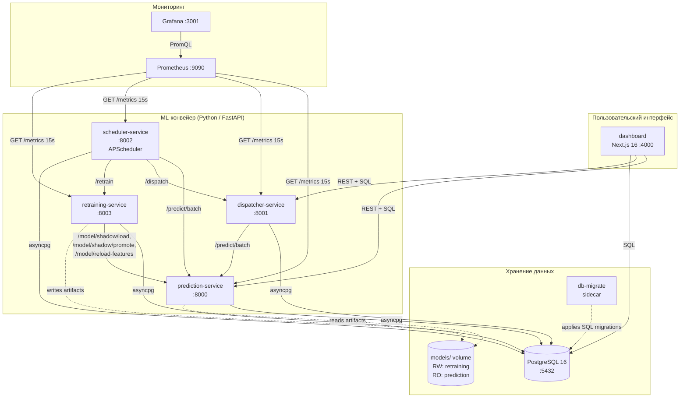
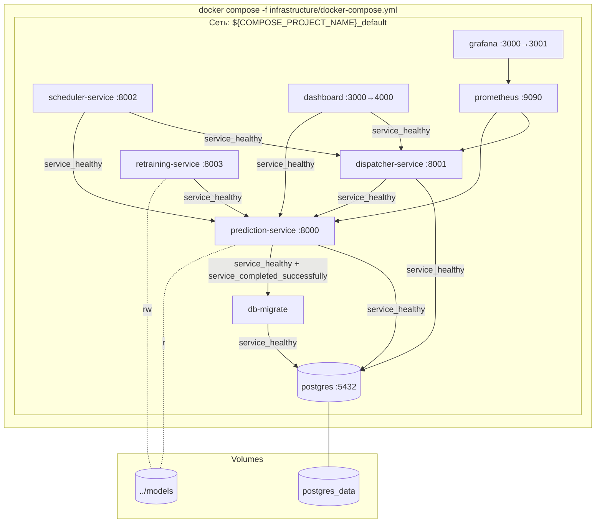

# Архитектура системы

## Обзор

Система автоматического вызова транспорта построена как набор слабо связанных микросервисов, взаимодействующих через HTTP API и общую базу данных PostgreSQL. С момента стартового прототипа архитектура расширилась с трёх сервисов до **пяти**: появились `scheduler-service` (оркестратор ML-конвейера) и `retraining-service` (champion/challenger переобучение), а Streamlit-дашборд заменён на полноценный Next.js 16 + React 19 frontend.

## Диаграмма компонентов



## Компоненты системы

### 1. prediction-service (FastAPI, порт 8000)

**Назначение:** принимает текущие статусные данные маршрута и возвращает прогноз отгрузок на 5 часов вперёд (10 шагов × 30 мин).

**Внутренняя структура:**

```
prediction-service/
├── app/
│   ├── api/
│   │   ├── routes.py          # /predict, /predict/batch, /model/*, /health
│   │   └── schemas.py         # Pydantic-модели запросов/ответов
│   ├── core/
│   │   ├── model.py           # ModelManager — primary + shadow + mock
│   │   └── feature_engine.py  # InferenceFeatureEngine (lag/diff/rolling)
│   ├── storage/
│   │   ├── postgres.py        # asyncpg + SQLAlchemy async
│   │   └── status_history.py  # StatusHistoryManager
│   ├── config.py              # Pydantic settings (env-driven)
│   └── main.py                # FastAPI lifespan + fail-fast guard
```

**Ключевые особенности:**

- **Fail-fast startup guard.** При старте проверяется наличие трёх артефактов: `model.pkl`, `static_aggs.json`, `fill_values.json`. Если хотя бы один отсутствует — сервис **падает с явной ошибкой**, чтобы ни одно окружение не отдавало синтетические прогнозы за реальные. Локально это поведение можно отключить флагом `MOCK_MODE=1`, тогда включается детерминированный mock-предиктор и `/health` отдаёт `status: "mock"`.
- **Versioned API surface.** Все эндпоинты доступны и под префиксом `/api/v1/...` (PRD §6) дополнительно к легаси-путям.
- **Shadow-модель.** `ModelManager` поддерживает параллельную загрузку shadow-модели для A/B сравнения. Её предсказания сохраняются в `forecasts` с собственным `model_version`. Управление: `POST /model/shadow/load`, `POST /model/shadow/promote`, `DELETE /model/shadow`.
- **Hot-reload.** `POST /model/reload` перечитывает primary с диска без рестарта; `POST /model/reload-features` пересинхронизирует `static_aggs.json` / `fill_values.json` после нового тренинга.
- **Cold-start fallback.** Если у маршрута меньше 24 наблюдений (≈12 часов), feature engine берёт среднее по складу.

**Жизненный цикл `/predict`:**

1. Загрузка истории маршрута из `route_status_history` (до 288 наблюдений)
2. Резолв `warehouse_id` (из истории, иначе из `routes`)
3. `append_status_observation` — текущее наблюдение пишется в историю
4. Cold-start защита: при недостатке данных подмешивается среднее по складу
5. `InferenceFeatureEngine.build_features` — lag/diff/rolling + статические агрегаты
6. Primary inference (LightGBM)
7. Shadow inference (если shadow загружена) — сохраняется отдельной строкой `forecasts`
8. Сохранение primary прогноза в `forecasts`
9. Возврат `ForecastStep[]` клиенту

### 2. dispatcher-service (FastAPI, порт 8001)

**Назначение:** преобразует прогнозы в заявки на транспорт; экспонирует PRD-совместимый API для дашборда и внешних потребителей.

**Внутренняя структура:**

```
dispatcher-service/
├── app/
│   ├── api/
│   │   ├── routes.py          # Легаси: /dispatch, /dispatch/schedule, /warehouses, /health
│   │   ├── routes_v1.py       # PRD §6.2/§9.2: /api/v1/transport-requests, /api/v1/metrics/business
│   │   └── schemas.py         # Pydantic-модели (legacy + PRD-shape)
│   ├── core/
│   │   ├── dispatcher.py      # DispatchCalculator
│   │   └── warehouse.py       # WarehouseRegistry
│   ├── storage/postgres.py
│   ├── config.py
│   └── main.py
```

**Алгоритм диспатчинга (`DispatchCalculator`):**

1. `aggregate_forecasts_by_warehouse` — суммирование `predicted_value` по слотам
2. `calculate_trucks` — `max(min_trucks, ceil(containers * (1 + buffer) / capacity))`
3. `generate_dispatch_requests` — формирование заявок со строкой `calculation`
4. `create_full_dispatch` — оркестрация полного цикла + дедупликация по `(warehouse_id, time_slot_start, time_slot_end)`

**Adaptive buffer.** Если `ADAPTIVE_BUFFER=true`, буфер плавающий между `MIN_BUFFER_PCT` и `MAX_BUFFER_PCT` в зависимости от исторической ошибки прогноза.

**PRD-API:**
- `GET /api/v1/transport-requests?office_id=&from=&to=` — заявки склада за окно (PRD §6.2)
- `GET /api/v1/metrics/business?from=&to=` — `order_accuracy` и `avg_truck_utilization` (PRD §9.2). Считаются только по слотам с заполненными `actual_vehicles` / `actual_units`.

### 3. scheduler-service (FastAPI + APScheduler, порт 8002)

**Назначение:** периодически прогоняет prediction → dispatch цикл, проверяет качество, инициирует переобучение и backfill фактических значений.

**Структура:**

```
scheduler-service/
├── app/
│   ├── api/routes.py          # /pipeline/*, /quality/*, /health
│   ├── core/
│   │   ├── pipeline.py        # PipelineOrchestrator
│   │   ├── quality.py         # QualityChecker
│   │   └── backfill.py        # BackfillRunner
│   ├── storage/postgres.py
│   ├── config.py
│   └── main.py                # APScheduler с тремя interval-задачами
```

**Три фоновых задачи (APScheduler `AsyncIOScheduler`):**

| Задача | Интервал | Что делает |
|--------|----------|-----------|
| `prediction_cycle` | `PREDICTION_INTERVAL_MINUTES` (30) | Подбирает свежие наблюдения, дёргает `/predict/batch`, потом `/dispatch` |
| `quality_check` | `QUALITY_CHECK_INTERVAL_MINUTES` (60) | Считает WAPE+RBias по `forecasts` vs `route_status_history.target_2h`, сохраняет в `prediction_quality`, проверяет shadow-streak и при достижении `SHADOW_PROMOTE_STREAK_THRESHOLD` (3) дёргает `POST /retrain` |
| `backfill_target_2h` | 30 | Дописывает фактический `target_2h` в `route_status_history` и `transport_requests.actual_*` |

**HTTP API** (для оператора и UI):
- `GET /pipeline/status` — снапшот состояния оркестратора и quality checker
- `POST /pipeline/trigger` — внеочередной запуск цикла
- `GET /pipeline/history?limit=` — аудит-лог из `pipeline_runs`
- `POST /quality/trigger` / `GET /quality/alerts`

### 4. retraining-service (FastAPI + LightGBM, порт 8003)

**Назначение:** champion/challenger-переобучение модели на свежих данных, реестр версий, безопасный промоут через shadow.

**Структура:**

```
retraining-service/
├── app/
│   ├── api/routes.py          # /retrain, /models, /models/{v}/shadow, /models/{v}/promote
│   ├── core/
│   │   ├── trainer.py         # ModelTrainer (fetch → features → train → eval)
│   │   └── registry.py        # ModelRegistry (model_metadata + HTTP к prediction)
│   ├── storage/postgres.py
│   ├── config.py
│   └── main.py
```

**Конвейер `/retrain` (защищён `asyncio.Lock` — только один запуск одновременно):**

1. `fetch_training_data(training_window_days)` — забор сырых данных из `route_status_history`
2. `build_features` — те же признаки, что и в inference
3. `train_model` — LightGBM на тред-пуле (не блокирует event loop)
4. `save_model` → `models/<version>.pkl`
5. `save_static_aggs` — пересчёт `static_aggs.json` и `fill_values.json`
6. Сравнение с champion (`compare_champion_challenger`)
7. `register_model` — запись в `model_metadata`
8. Если challenger лучше — `POST prediction-service/model/shadow/load`
9. Запись результата в `retrain_history`

Промоут shadow → primary происходит либо вручную (`POST /models/{version}/promote`), либо автоматически из `scheduler-service` после streak побед.

**`models/` volume** смонтирован:
- `retraining-service` — read-write (producer)
- `prediction-service` — read-only (consumer)

Это намеренный producer/consumer-контракт: prediction никогда не пишет в общий каталог.

### 5. dashboard (Next.js 16, порт 4000)

**Назначение:** operator UI для просмотра прогнозов, заявок, KPI и состояния системы.

**Стек:** Next.js 16 (App Router) + React 19 + TypeScript 5 + Tailwind CSS 4 + Recharts + Radix UI + lucide-react. Сборка через `next build` в **standalone** режиме, контейнер запускается через `node server.js`.

**Страницы (App Router):**

| Маршрут | Файл | Содержание |
|---------|------|------------|
| `/` | `app/page.tsx` | Редирект на `/overview` |
| `/overview` | `app/overview/page.tsx` | Сводка по складам и метрики |
| `/forecasts` | `app/forecasts/page.tsx` | Графики прогнозов по складам/маршрутам |
| `/dispatch` | `app/dispatch/page.tsx` | Таблица заявок на транспорт |
| `/quality` | `app/quality/page.tsx` | WAPE/RBias + бизнес-KPI |
| `/readiness` | `app/readiness/page.tsx` | Health-чеки сервисов и состояние конвейера |

**Server-side API routes** (`app/api/...`):
- `app/api/db/...` — прямые SQL-запросы к PostgreSQL через `pg` (`node-postgres`)
- `app/api/dispatch`, `app/api/metrics/business`, `app/api/health/[service]`, `app/api/model/info` — прокси-эндпоинты к downstream-сервисам, чтобы клиентский браузер не дергал backend-контейнеры напрямую

### 6. PostgreSQL + db-migrate

**PostgreSQL 16** — единое хранилище. Бэйз-схема создаётся `infrastructure/postgres/init.sql` при первом старте, дополнительные изменения — через идемпотентные миграции в `infrastructure/postgres/migrations/`.

**`db-migrate` sidecar** — это контейнер `postgres:16-alpine`, который запускается после healthcheck базы и проигрывает все `.sql` файлы из `migrations/` в лексикографическом порядке. POSIX-shell скрипт сделан под busybox `ash` (без `bash arrays`/`shopt`). Запуск идемпотентный — все миграции содержат `IF NOT EXISTS` / guarded `DO`-блоки. Все остальные сервисы зависят от него через `condition: service_completed_successfully`, поэтому никто не стартует, пока схема не приведена к актуальному виду.

**Таблицы:**

| Таблица | Назначение |
|---------|-----------|
| `route_status_history` | История наблюдений (`status_1..8`, `target_2h`) — источник для feature engineering |
| `forecasts` | Сохранённые прогнозы (primary и shadow различаются `model_version`) |
| `transport_requests` | Заявки на транспорт; столбцы `actual_vehicles` / `actual_units` для KPI |
| `routes`, `warehouses` | Справочники |
| `model_metadata` | Реестр обученных моделей (используется `ModelRegistry`) |
| `pipeline_runs` | Аудит-лог запусков scheduler |
| `prediction_quality` | Снимки WAPE/RBias/`combined_score` от quality checker |
| `retrain_history` | Аудит-лог переобучений |

**Ключевые индексы:**

- `route_status_history` — `(route_id, timestamp DESC)` и `(warehouse_id)`
- `forecasts` — `(warehouse_id, anchor_ts)`, `(route_id, anchor_ts)`, `(created_at)`
- `transport_requests` — `(warehouse_id, time_slot_start)`, `(status)`, частичный индекс по слотам с `actual_vehicles IS NOT NULL`
- `pipeline_runs` — `(started_at DESC)`, `(run_type)`
- `prediction_quality` — `(checked_at DESC)`
- `retrain_history` — `(status, started_at DESC)`

### 7. Prometheus + Grafana

**Prometheus** скрейпит `/metrics` каждые 15 секунд со всех четырёх FastAPI-сервисов. Метрики экспонируются библиотекой `prometheus-fastapi-instrumentator`:

- `http_request_duration_seconds` — histogram латентности
- `http_requests_total` — counter запросов
- `http_request_size_bytes`, `http_response_size_bytes` — summary размеров

**Grafana** грузит datasources и дашборды из `infrastructure/grafana/provisioning/`. Анонимный доступ выключен по умолчанию (`GF_AUTH_ANONYMOUS_ENABLED=false`) — на shared Wi-Fi бизнес-метрики не должны утекать. Включить можно через `.env` для изолированной локальной демонстрации. Внешний порт по умолчанию `3001`, чтобы не конфликтовать с локальным `next dev` на `3000`.

## Поток данных

```
Сырые наблюдения (status_1..8 + route_id + timestamp)
    │
    ▼
[scheduler-service: prediction_cycle каждые 30 мин]
    │ берёт свежие наблюдения,
    │ дёргает /predict/batch
    ▼
[prediction-service]
    ├─ append_status_observation → route_status_history
    ├─ build_features (lag/diff/rolling + static_aggs)
    ├─ primary inference (LightGBM)
    ├─ shadow inference (опционально)
    ├─ save forecasts (primary + shadow)
    └─ возвращает ForecastStep[]
            │
            ▼
[scheduler-service]
    │ агрегирует ответы и
    │ дёргает /dispatch
    ▼
[dispatcher-service]
    ├─ aggregate_forecasts_by_warehouse
    ├─ calculate_trucks (с учётом adaptive buffer)
    ├─ generate_dispatch_requests
    └─ save_transport_requests (UPSERT)
            │
            ▼
[scheduler-service: backfill_target_2h каждые 30 мин]
    └─ fills route_status_history.target_2h
       и transport_requests.actual_vehicles/actual_units
            │
            ▼
[scheduler-service: quality_check каждые 60 мин]
    ├─ WAPE + RBias по forecasts vs target_2h
    ├─ save prediction_quality
    └─ при streak побед shadow → POST retraining/retrain
            │
            ▼
[retraining-service]
    ├─ fetch_training_data(window_days)
    ├─ build_features → train_model (LightGBM)
    ├─ save_model + save_static_aggs (writable models/)
    ├─ register_model → model_metadata
    └─ POST prediction/model/shadow/load → A/B
            │
            ▼
[dashboard-next]
    ├─ /overview, /forecasts, /dispatch (REST + SQL)
    ├─ /quality (PRD KPI + WAPE/RBias история)
    └─ /readiness (health всех сервисов)
```

## Выбор технологий

| Решение | Альтернативы | Обоснование |
|---------|--------------|-------------|
| FastAPI | Flask, Django | Async, авто-OpenAPI, Pydantic-валидация |
| LightGBM | CatBoost, XGBoost | Лучший CV score (0.292) на данных соревнования, быстрый inference |
| APScheduler | Celery beat, cron | Запускается внутри того же контейнера, не требует брокера |
| Next.js 16 + React 19 | Streamlit, Gradio | Production-grade UI, SSR/Server Components, типизация end-to-end |
| PostgreSQL 16 | SQLite, MongoDB | ACID, JSONB, индексы, partial indexes для KPI-выборок |
| db-migrate sidecar | Alembic, Flyway | Минимальная зависимость (одно `psql` в alpine), идемпотентные SQL-файлы |
| Docker Compose v2 | Kubernetes, Nomad | Один файл, одна команда, переносится между ноутбуком и CI |
| Prometheus + Grafana | Datadog, New Relic | Open-source, стандарт индустрии |

## Решения по надёжности

- **Healthchecks везде.** Каждый Python-контейнер проверяет `/health` через stdlib `urllib`; dashboard — через node `fetch('/')` (Node 22 ships global fetch). `compose-level` healthcheck дублирует Dockerfile-уровневый, чтобы можно было править cadence без пересборки образа. Все healthchecks указывают `start_period`, чтобы compose не флапал во время прогрева.
- **`stop_grace_period: 30s`** для всех app-контейнеров; uvicorn запущен с `--timeout-graceful-shutdown 25` — in-flight запросы успевают завершиться до SIGKILL.
- **`condition: service_healthy`** в `depends_on` — dispatcher и dashboard не стартуют, пока prediction не отвечает 200 на `/health`; всё опирается на `db-migrate: service_completed_successfully`, гарантируя что схема актуальна.
- **`MOCK_MODE` fail-fast guard.** Без артефактов модели prediction-service падает, а не тихо отдаёт фейк. Это сознательное архитектурное решение — гипотеза «mock в проде никто не заметит» уже проверена болезненным опытом.
- **PostgreSQL bind на loopback.** Порт `5432` биндится только к `127.0.0.1`, чтобы dev-БД не торчала в LAN.
- **Producer/consumer контракт `models/`.** prediction монтирует каталог как `:ro`, retraining как `:rw` — на уровне Docker исключаем случайные записи из неположенного сервиса.

## Масштабирование

### Текущие ограничения (прототип)

- Все сервисы на одном хосте, по одному инстансу
- Параллельный batch-предикт ограничен `asyncio.Semaphore(10)` внутри prediction-service
- Один scheduler-инстанс — нет распределённого locking для job'ов

### Пути роста

1. **Горизонтальное масштабирование stateless-сервисов** (prediction, dispatcher) за load balancer
2. **Очередь событий** (Redis Streams / NATS / Kafka) для отвязки prediction → dispatcher
3. **Распределённый scheduler** (Celery beat + Redis lock или Temporal) для multi-replica
4. **Партиционирование `route_status_history`** по `warehouse_id` или времени
5. **Кэширование hot reads** через Redis для `/warehouses` и `/dispatch/schedule`

## Deployment-архитектура



**Порядок старта** (через `depends_on` + healthchecks):

1. **postgres** (healthcheck: `pg_isready`)
2. **db-migrate** (one-shot, ждёт `service_healthy` postgres, должен завершиться `service_completed_successfully`)
3. **prediction-service** (ждёт postgres + db-migrate; проверяет `models/`, при отсутствии — fail-fast или mock)
4. **dispatcher-service** (ждёт postgres + db-migrate + prediction-service `service_healthy`)
5. **scheduler-service** (ждёт postgres + db-migrate + prediction + dispatcher)
6. **retraining-service** (ждёт postgres + db-migrate + prediction)
7. **dashboard** (ждёт postgres + db-migrate + prediction + dispatcher)
8. **prometheus** (ждёт prediction + dispatcher)
9. **grafana** (ждёт prometheus)
