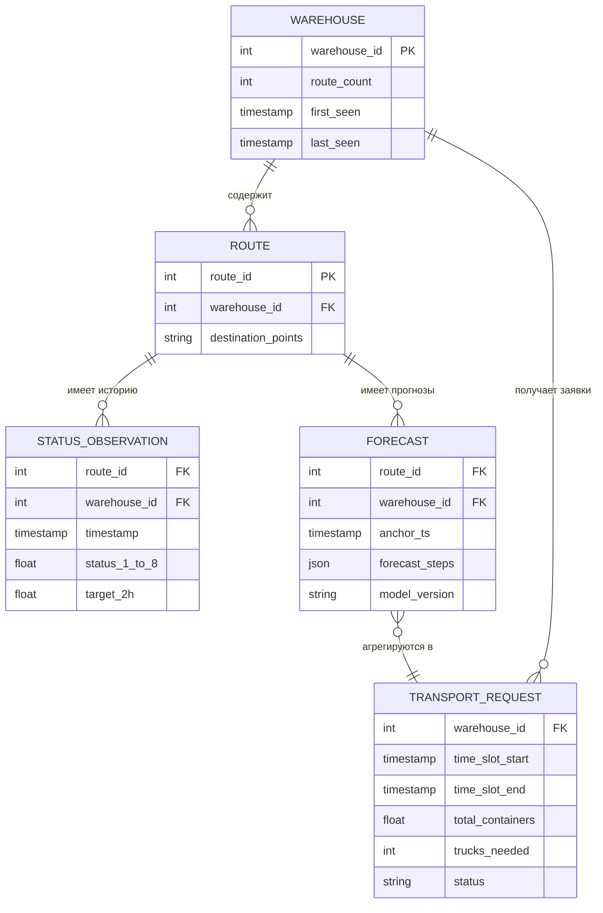

# Бизнес-логика

## Доменная модель

### Основные сущности



### Глоссарий

| Термин | Определение |
|--------|------------|
| **Склад (Warehouse)** | Отправляющий объект (`office_from_id`). Транспорт вызывается на склад |
| **Маршрут (Route)** | Направление от склада к набору точек назначения (`route_id`). Привязка маршрутов к складам не изменяется |
| **Статусы (status_1..8)** | Этапы обработки товаров на складе за последние 30 минут. Более высокий индекс приближённо соответствует более поздней стадии обработки. status_4-6: товары с предыдущих складов в пути |
| **target_2h** | Целевая переменная — количество ёмкостей, отгруженных по маршруту за последние 2 часа |
| **Ёмкость (Container)** | Единица отгрузки. Объём прогнозируемых отгрузок измеряется в ёмкостях |
| **Заявка на транспорт** | Запрос на подачу определённого количества машин на склад к указанному времени |

## Прогнозная модель

### Подход

Модель предсказывает `target_2h` (количество ёмкостей, отгруженных за 2 часа) для каждого маршрута. Прогноз строится на 10 шагов вперёд (каждый шаг = 30 минут, итого 5 часов).

### Алгоритм

- **LightGBM Regressor** с MAE (regression_l1) objective
- **Окно обучения:** 7 дней (288 наблюдений x 30 минут)
- **Количество деревьев:** 5000 (n_estimators)
- **Признаки:** lag-значения, скользящие средние (rolling), разности (diff) по всем статусам status_1..8

### Feature Engineering (Inference)

При inference `InferenceFeatureEngine` строит признаки из истории маршрута:

1. **Lag-фичи** — значения статусов и target за предыдущие шаги
2. **Diff-фичи** — разности между последовательными значениями (скорость изменения)
3. **Rolling-фичи** — скользящие средние и суммы за окна разной ширины

Для построения признаков необходимо минимум 288 исторических наблюдений (6 дней), хранящихся в таблице `route_status_history`.

### Качество модели

| Метрика | Значение |
|---------|----------|
| CV Score (WAPE + \|Relative Bias\|) | 0.292 |
| Objective | MAE (regression_l1) |
| Горизонт прогноза | 10 шагов (5 часов) |
| Интервал шага | 30 минут |

## Алгоритм диспатчинга

### Обзор

Диспатчер преобразует прогнозы отгрузок (уровень маршрута) в заявки на транспорт (уровень склада).

### Шаг 1: Агрегация прогнозов

Прогнозы по всем маршрутам одного склада суммируются для каждого временного слота:

```
total_containers[warehouse, time_slot] = SUM(predicted_target_2h[route_i, time_slot])
                                         для всех route_i принадлежащих warehouse
```

### Шаг 2: Расчёт количества машин

Для каждого временного слота рассчитывается необходимое количество машин:

```
trucks = ceil(total_containers * (1 + buffer_pct) / truck_capacity)
```

Где:
- `total_containers` — суммарный прогноз ёмкостей на слот
- `buffer_pct` — процент буфера для компенсации ошибки прогноза (по умолчанию 10%)
- `truck_capacity` — вместимость одной машины в ёмкостях (по умолчанию 33)
- `ceil()` — округление вверх (нельзя отправить дробное число машин)

**Особые случаи:**
- Если `total_containers = 0`, то `trucks = 0` (машины не нужны)
- Если результат расчёта меньше `min_trucks` (и `total_containers > 0`), возвращается `min_trucks`

### Шаг 3: Формирование заявок

Для каждого временного слота с ненулевым количеством машин создаётся заявка:

```json
{
    "warehouse_id": 42,
    "time_slot_start": "2026-04-02T14:00:00",
    "time_slot_end": "2026-04-02T16:00:00",
    "total_containers": 95.7,
    "truck_capacity": 33,
    "buffer_pct": 0.10,
    "trucks_needed": 4,
    "calculation": "ceil(95.7 * (1 + 0.1) / 33) = ceil(105.27 / 33) = 4",
    "status": "planned"
}
```

### Развёрнутый пример

**Исходные данные:**
- Склад #42 имеет 3 маршрута: R1, R2, R3
- Прогноз на слот 14:00-16:00:
  - R1: 30.5 ёмкостей
  - R2: 45.2 ёмкостей
  - R3: 20.0 ёмкостей

**Расчёт:**

```
1. Агрегация: total = 30.5 + 45.2 + 20.0 = 95.7 ёмкостей

2. С буфером: buffered = 95.7 * (1 + 0.10) = 95.7 * 1.10 = 105.27

3. Количество машин: trucks = ceil(105.27 / 33) = ceil(3.19) = 4

4. Заявка: 4 машины на склад #42 к 14:00
```

## Настраиваемые параметры

| Параметр | Переменная окружения | По умолчанию | Описание |
|----------|---------------------|--------------|----------|
| Вместимость машины | `TRUCK_CAPACITY` | 33 | Количество ёмкостей, которое помещается в одну машину |
| Процент буфера | `BUFFER_PCT` | 0.10 (10%) | Запас на ошибку прогноза. Увеличивает прогнозируемый объём перед расчётом машин |
| Минимум машин | `MIN_TRUCKS` | 1 | Минимальное количество машин при ненулевом прогнозе |
| Шагов прогноза | `FORECAST_STEPS` | 10 | Количество шагов прогноза (10 x 30 мин = 5 часов) |
| Интервал шага | `STEP_INTERVAL_MINUTES` | 30 | Длительность одного шага прогноза в минутах |
| Окно истории | `HISTORY_WINDOW` | 288 | Количество исторических наблюдений для feature engineering (288 x 30 мин = 6 дней) |
| Версия модели | `MODEL_VERSION` | v1 | Идентификатор версии модели для трекинга |

## Бизнес-допущения

### 1. Однородный транспорт

**Допущение:** Все машины имеют одинаковую вместимость (33 ёмкости по умолчанию).

**Обоснование:** Упрощает расчёт и достаточно для прототипа. В реальности вместимость можно задать через `TRUCK_CAPACITY`.

**Путь развития:** Ввести несколько типов транспорта с разной вместимостью и решать задачу bin packing для оптимального распределения.

### 2. Диспатчинг на уровне склада

**Допущение:** Транспорт вызывается на склад (`office_from_id`), а не на отдельный маршрут.

**Обоснование:** Логистически машина прибывает на склад и загружается товарами для разных маршрутов. Оптимизация на уровне маршрутов потребовала бы решения задачи маршрутизации (VRP), выходящей за рамки прототипа.

### 3. Фиксированный буфер

**Допущение:** Буфер 10% линейно увеличивает прогнозируемый объём.

**Обоснование:** Компенсирует ошибку модели (WAPE ~ 0.29). Фиксированный процент — простой и предсказуемый подход.

**Путь развития:** Адаптивный буфер, зависящий от исторической ошибки для конкретного склада или маршрута.

### 4. Горизонт планирования 5 часов

**Допущение:** 10 шагов по 30 минут достаточно для планирования.

**Обоснование:** 5 часов — достаточный горизонт для организации подачи транспорта. При увеличении горизонта качество прогноза падает.

### 5. Один маршрут — один склад

**Допущение:** Каждый маршрут привязан ровно к одному складу (связь многие-к-одному).

**Обоснование:** Подтверждено организаторами соревнования: "Привязка маршрутов к складам в рамках задачи не изменяется".

### 6. Минимум одна машина при ненулевом прогнозе

**Допущение:** Если прогнозируется хотя бы какой-то объём отгрузок, отправляется минимум одна машина.

**Обоснование:** Лучше отправить одну лишнюю машину, чем оставить склад без транспорта.

## Оценка качества

### Метрика соревнования

```python
class WapePlusRbias:
    def calculate(self, y_true: np.ndarray, y_pred: np.ndarray) -> float:
        wape = (np.abs(y_pred - y_true)).sum() / y_true.sum()
        rbias = np.abs(y_pred.sum() / y_true.sum() - 1)
        return wape + rbias
```

- **WAPE (Weighted Absolute Percentage Error):** Взвешенная абсолютная ошибка. Чем меньше, тем точнее прогноз.
- **Relative Bias:** Систематическое отклонение прогноза. |0| означает отсутствие смещения.

### Бизнес-метрики (предлагаемые)

| Метрика | Формула | Значение |
|---------|---------|----------|
| Точность прогноза | WAPE + \|RBias\| | Основная метрика модели |
| Избыточность транспорта | (trucks_sent - trucks_needed) / trucks_needed | Стоимость перестраховки |
| Недостаточность транспорта | max(0, containers - trucks_sent * capacity) / containers | Риск невывоза |
| Среднее время отклика | avg(request_to_dispatch_time) | Операционная эффективность |

### Подход к тестированию

1. **Бэклайн-сравнение:** наивный прогноз (значение предыдущего шага) как базовая линия
2. **Временная валидация (OOT):** обучение на первых N дней, тестирование на последних
3. **Мониторинг дрифта:** отслеживание WAPE по дням для выявления деградации модели
