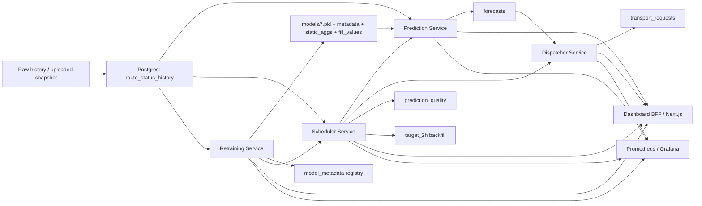

# Защита хакатона: текст презентации по коду

Этот текст собран по фактической реализации в репозитории: `services/`, `final_submissions/`, `experiments/`, `Notebooks/`, `infrastructure/`, `scripts/`.
Ниже нет опоры на README как на источник истины. Если формулировка попала сюда, ее можно защитить ссылкой на код.

---

## 1. Что у нас реально реализовано

### Коротко

Это не просто модель прогноза. В репозитории реализован прототип полного продукта:

1. сбор и хранение истории статусов маршрутов;
2. онлайн-прогноз отгрузки по маршрутам;
3. агрегация прогноза до уровня склада;
4. расчет потребности в машинах;
5. сохранение заявок на транспорт;
6. scheduler для регулярного запуска пайплайна;
7. quality loop с backfill, оценкой ошибок и shadow promotion;
8. retraining-service с registry и загрузкой нового датасета;
9. dashboard + Prometheus + Grafana.

### Что это значит для защиты

Главная сильная сторона проекта не в том, что "мы обучили модель", а в том, что мы довели прогноз до операционного действия:

`status_1..8 -> прогноз отгрузки -> агрегирование по складу -> расчет машин -> транспортная заявка`

Именно это нужно держать как центральную линию презентации.

---

## 2. Фактическая картина данных

По `Data/raw/*.parquet`:

- `train_team_track.parquet`: `4 342 000` строк
- `test_team_track.parquet`: `10 000` строк
- `train_solo_track.parquet`: `4 630 000` строк
- `test_solo_track.parquet`: `8 000` строк
- в team track: `1000` маршрутов и `53` склада
- временной шаг: `30 минут`
- у каждого маршрута в team train ровно `4342` наблюдения

По team dataset:

- среднее `target_2h`: `68.75`
- 95-й перцентиль `target_2h`: `196`
- максимум `target_2h`: `1517`
- доля нулей в `target_2h`: около `4.87%`
- в последних 14 днях есть `16` zero-routes, которые затем отдельно обрабатываются в конкурсном сабмите

### Текст на слайд

У нас не игрушечный датасет: 4.34 млн наблюдений, 1000 маршрутов, 53 склада и полчасовой временной шаг. Это позволяет строить не только модель, но и полноценный контур сервиса с регулярным обновлением прогнозов.

### Что сказать голосом

Важно подчеркнуть, что структура данных уже похожа на реальную операционную систему: есть маршрут, склад, временной ряд статусов и целевая переменная на горизонте 2 часа. Это хорошо ложится на промышленный сервисный пайплайн.

---

## 3. Граф системы

### Главный тезис

У нас есть не набор независимых скриптов, а замкнутый контур принятия решений с переобучением и контролем качества.

---

## 4. Архитектура сервиса

По `infrastructure/docker-compose.yml` поднимаются:

- `postgres`
- `prediction-service`
- `dispatcher-service`
- `scheduler-service`
- `retraining-service`
- `dashboard` на Next.js
- `prometheus`
- `grafana`

### Что делает каждый сервис

#### `prediction-service`

- хранит active model в памяти;
- берет последние `288` точек истории по маршруту, то есть `6 дней`;
- добавляет текущее наблюдение;
- строит фичи на `10` горизонтов вперед;
- выдает прогноз на `5 часов` вперед с шагом `30 минут`;
- пишет прогнозы в таблицу `forecasts`;
- поддерживает `shadow` модель и hot reload.

#### `dispatcher-service`

- берет прогнозы по складу;
- агрегирует контейнеры по слотам;
- переводит контейнеры в число машин;
- сохраняет заявки в `transport_requests`;
- применяет antiflap-логику, чтобы не дергать заявки из-за мелких изменений прогноза.

#### `scheduler-service`

- по расписанию запускает prediction + dispatch цикл;
- делает quality check;
- запускает backfill `target_2h`;
- ведет аудит пайплайна в `pipeline_runs`.

#### `retraining-service`

- переобучает production-модель;
- сохраняет artifact + metadata + static aggs + fill values;
- ведет registry моделей;
- умеет force-refresh при загрузке нового датасета;
- умеет продвигать shadow в primary.

#### `dashboard`

- это не прямой клиент к БД, а BFF-слой;
- проксирует чтение через сервисные API;
- показывает прогнозы, заявки, readiness, quality и реестр моделей.

### Текст на слайд

Мы разделили решение на независимые сервисы по ответственности: прогноз, диспетчеризация, оркестрация, переобучение и операторский интерфейс. Это позволяет отдельно масштабировать узкие места и не смешивать ML-логику с бизнес-операциями.

---

## 5. Онлайн-логика продукта: как прогноз превращается в заявку

Это ключевой слайд. Его надо "разжевать" лучше всего.

### Фактический pipeline

1. `scheduler-service` берет активные маршруты и их последние статусы.
2. Для каждого маршрута вызывает `prediction-service /predict/batch`.
3. `prediction-service`:
   - достает историю маршрута;
   - при cold start переключается на усредненную историю склада;
   - строит фичи;
   - выдает 10 шагов прогноза;
   - пишет прогнозы в БД.
4. `scheduler-service` затем по каждому складу вызывает `dispatcher-service`.
5. `dispatcher-service`:
   - читает прогнозы по нужному временному окну;
   - агрегирует по складу и слоту;
   - считает количество машин;
   - сохраняет транспортные заявки.

### Важные детали из кода

- шаг прогноза: `30 минут`
- горизонт прогноза: `10` шагов = `5 часов`
- cold start: если истории по маршруту меньше `24` точек, используется средняя история по складу
- batch prediction идет chunk-ами по `50` маршрутов
- параллелизм batch prediction ограничен `Semaphore(10)`

### Формула перехода от прогноза к машинам

Из `services/dispatcher-service/app/core/dispatcher.py`:

`trucks_needed = ceil(total_containers * (1 + buffer_pct) / truck_capacity)`

Текущие production-параметры по умолчанию:

- `truck_capacity = 33`
- `buffer_pct = 0.10`
- `min_trucks = 1`

Плюс есть режим `adaptive_buffer`, когда буфер автоматически меняется от `5%` до `25%` в зависимости от объема.

### Antiflap

Если новая оценка отличается от уже сохраненной заявки не больше чем на `1` машину, обновление пропускается.

Это важно для защиты, потому что показывает бизнес-мышление:

мы не просто оптимизируем метрику, мы уменьшаем операционный шум.

### Текст на слайд

Наш сервис не останавливается на прогнозе. Он автоматически доводит его до операционного решения: агрегирует спрос на транспорт по складу и времени, рассчитывает количество машин и сохраняет заявку с прозрачной формулой расчета.

---

## 6. Production-модель, которая реально обслуживает сервис

Это отдельный слайд. Здесь нельзя путать production и конкурсный стек.

### Что реально стоит в сервисе

Production-модель обучается кодом из:

- `services/retraining-service/app/core/trainer.py`
- локально воспроизводится через `final_submissions/production_team_model/train_production_model.py`

Это `LightGBM` с `objective='regression_l1'`.

### Production feature set

По коду у production-модели `312` признаков:

- `8` raw status features
- `19` агрегированных status/inventory features
- `56` target lag/diff/rolling features
- `160` inventory lag/diff/rolling features
- `64` detailed status lag features
- `5` категориальных time/horizon features

Итого: `312`.

### Production training setup

- train window: последние `30 дней`
- выборка для последнего обучения: `1 441 000` строк
- validation: последние `10` timestamp-ов, то есть `10 000` строк
- loss: `MAE`
- `n_estimators = 5000`
- `learning_rate = 0.025`
- `num_leaves = 63`
- `max_depth = 9`

### Production validation quality

По `models/model_metadata.json`:

- `WAPE = 0.00808`
- `RBias = 0.00021`
- `combined = 0.008289`
- `MAE = 0.532701`

### Baseline comparison

Из `services/retraining-service/app/core/baseline.py` baseline считается как среднее по:

`(route_id, hour_of_day, day_of_week)`

На том же last-30-days OOT split baseline дает:

- `WAPE = 0.360539`
- `RBias = 0.019376`
- `combined = 0.379915`

То есть production LightGBM по коду радикально лучше наивного сезонного lookup baseline.

### Сильная формулировка для защиты

Мы не просто "поставили бустинг". У нас есть честный production baseline и кодовая процедура сравнения champion vs challenger. Это уже MLOps-подход, а не только соревнование по leaderboard.

---

## 7. Конкурсный ML-стек для team track

Этот слайд про офлайн-решение под лидерборд. Его надо честно отделить от online-serving.

### Что видно по коду

#### `final_submissions/team/01_build_features.py`

Формируется финальный team feature space на `489` признаков.

Разложение по семействам:

- `7` categorical features
- `8` raw statuses
- `19` total/inventory features
- `56` target lag/diff/rolling
- `160` inventory lag/diff/rolling
- `64` detailed status lags
- `64` static aggregation features по статусам
- `80` static aggregation features по total inventory
- `12` historical target statistics
- `19` extra Kaggle-like features

Итого: `489`.

#### `final_submissions/team/02_train_lgb.py`

LightGBM Hybrid:

- отдельные модели для горизонтов `1..5`
- одна глобальная модель для горизонтов `6..10`
- оптимизируется `MAE`

#### `final_submissions/team/03_train_mlp.py`

ResMLP Pyramid:

- `1536 -> 768 -> 384 -> 192`
- `GELU`
- `BatchNorm`
- `Dropout=0.2`
- `AdamW`
- `5 seed ensemble`
- target encoding для категориальных признаков

#### `final_submissions/team/04_submit.py`

Финальный сабмит:

- Ridge stacking над предсказаниями базовых моделей
- zero-routes post-processing
- поиск лучшего scale по honest OOF
- округление в integer counts

### Zero-routes

В коде явно есть правило:

- если у маршрута максимум `target_2h` за последние 14 дней равен нулю,
- то прогноз по этому маршруту на тесте обнуляется.

Таких маршрутов по вычислению на датасете: `16`.

### Что сказать голосом

Конкурсный стек максимально выжимает качество на leaderboard. Он богаче по признакам и тяжелее по обучению, но он не должен напрямую обслуживать production API. Поэтому мы сознательно разделили офлайн сабмит и онлайн сервис.

---

## 8. Почему мы разделили submission и production

Это один из самых важных смысловых слайдов.

### Честный тезис

У нас два контура:

1. **Submission-контур**: максимизирует метрику соревнования.
2. **Production-контур**: минимизирует сложность онлайна, время retrain и риск деградации сервиса.

### Почему это правильно

#### Submission-контур

- можно позволить ансамбли;
- можно позволить stacking;
- можно позволить тяжёлые GPU-модели;
- можно долго подбирать post-processing.

#### Production-контур

- должен быстро переобучаться;
- должен просто катиться в сервис;
- должен стабильно инференсить;
- должен быть прозрачен для операционной команды.

### Хорошая формулировка на защите

Мы не переносим leaderboard engineering в онлайн бездумно. В боевом контуре у нас компактный и объяснимый LightGBM, а лидербордовый стек остается офлайн-инструментом для максимального качества в рамках соревнования.

---

## 9. Честная валидация и качество ML

### Что есть в коде

В исследовательском и финальном ML-пайплайне используется out-of-time validation:

- `OOTValidator`
- последние `10` точек идут в validation
- используется fold gap
- train window ограничивается последними днями истории

То есть валидация имитирует реальный сценарий, когда модель не видит будущее.

### Что еще важно

- в `precompute_features.py` и team pipeline явно строится honest OOF
- scale и post-processing подбираются по OOF, а не по ручному probe лидерборда
- в production-контуре есть baseline и automated model registry

### Текст на слайд

Мы сознательно не опирались на публичный лидерборд как на главный сигнал качества. Основной сигнал для нас — out-of-time validation и honest OOF, потому что только они отражают реальную работу сервиса на будущих данных.

---

## 10. Контур качества и MLOps

Этот слайд хорошо выделяет проект на фоне обычных hackathon demo.

### Что реально реализовано в коде

#### Backfill target

`scheduler-service` каждые 30 минут запускает backfill:

- для старых записей, где `target_2h` еще пустой,
- ищется ближайшее фактическое наблюдение через 2 часа,
- и записывается label.

То есть сервис сам достраивает ground truth для последующей оценки.

#### Quality check

Каждый час:

- прогнозы разворачиваются по horizon steps;
- сопоставляются с фактом;
- считаются `WAPE`, `RBias`, `combined_score`.

#### Shadow promotion

Если shadow-модель подряд `3` раза выигрывает по WAPE у primary,
она автоматически может быть promoted в primary.

### Сильный тезис

У нас есть не только обучение модели, но и кодовый механизм ее безопасного обновления через shadow evaluation и streak-based promotion.

---

## 11. Работа с новыми данными

Очень важный продуктовый слайд.

### Что умеет `upload-dataset`

Из `services/retraining-service/app/api/upload.py`:

загрузка нового датасета запускает полный synchronous full-refresh workflow:

1. файл валидируется;
2. в транзакции очищается и пересобирается live snapshot;
3. обновляются `route_status_history`, `warehouses`, `routes`;
4. очищаются старые `forecasts` и `transport_requests`;
5. запускается retrain;
6. новая модель force-promote в primary;
7. scheduler триггерится для нового prediction+dispatch цикла.

### Почему это сильно

Это уже похоже на продуктовую схему обновления системы, когда оператор загружает новый актуальный срез, а система сама перестраивает рабочее состояние.

### Текст на слайд

Мы предусмотрели сценарий, когда входные данные меняются не постепенно, а снапшотом. В этом случае сервис не просто дообучает модель, а полностью пересобирает рабочее состояние и сразу переводит систему на новую реальность.

---

## 12. Операторский интерфейс и observability

### Dashboard

По `services/dashboard-next/app/*` реализованы страницы:

- `Overview`
- `Forecasts`
- `Dispatch`
- `Quality`
- `Readiness`

Что там важно:

- список складов и маршрутов;
- прогнозы по складам и маршрутам;
- запуск dispatch;
- просмотр quality метрик;
- readiness-проверки системы;
- registry моделей и retrain state.

### Observability

По `docker-compose` и `prometheus/grafana`:

- сервисы экспортируют метрики через `prometheus_fastapi_instrumentator`;
- есть `Prometheus`;
- есть `Grafana`;
- на все сервисы заведены `healthcheck`-и.

### Что сказать голосом

Мы сделали так, чтобы решение можно было не только показать на одном счастливом примере, но и эксплуатировать: есть UI для оператора, health/readiness слой и мониторинг.

---

## 13. Ограничения и честные риски

Это слайд повышает доверие. Его лучше оставить.

### Что честно сказать

1. Online-модель пока проще leaderboard-стека.
   Это осознанно: мы отдали приоритет надежности и простоте serving.

2. KPI по фактическому качеству заявок зависят от заполнения `actual_vehicles` и `actual_units`.
   Если эти поля не backfill-ятся в живой системе, order accuracy и utilization будут пустыми.

3. В текущем коде inference engine строит superset фичей.
   Но active production-модель после alignment реально использует только свои `312` признаков.

4. В репозитории нет воспроизводимых tracked-артефактов для точных коэффициентов Ridge-meta в финальном team stack.
   Поэтому на защите лучше говорить про сам stacking-подход, а не спорить за конкретные коэффициенты, если их не можете показать отдельным артефактом.

5. В коде нет подтвержденного latency benchmark.
   Поэтому не стоит обещать фиксированное "меньше 2 секунд" без отдельного замера.

---

## 14. Пути развития продукта

Это надо связать не с фантазией, а с тем, что уже просится из текущей архитектуры.

### Ближайший roadmap

1. Перевести online serving с single-model LGB на champion-challenger policy по нескольким production-кандидатам.

2. Добавить uncertainty-aware dispatch:
   не только point forecast, но и доверительный коридор, чтобы буфер по машинам зависел от неопределенности модели, а не только от объема.

3. Подключить дополнительные данные:
   - календарь акций,
   - day-off / holiday enrichment,
   - внешнюю загрузку склада,
   - SLA по отгрузке,
   - ограничения по доступному транспорту.

4. Развить feedback loop:
   использовать реальные факты по `actual_vehicles` и `actual_units` как бизнес-цель и обучать систему не только на точность прогноза отгрузки, но и на стоимость ошибки диспетчеризации.

5. Добавить scenario simulation в dashboard:
   оператор меняет capacity/buffer и сразу видит, как меняются заявки.

### Формулировка на слайд

Мы уже построили рабочий костяк сервиса. Следующий шаг — двигаться от "точного прогноза" к "оптимальному решению", то есть учитывать не только forecast error, но и стоимость нехватки и избытка транспорта.

---

## 15. Финальный вывод

### Короткая версия

Мы решили задачу не как отдельный ML-ноутбук, а как end-to-end систему:

- строим прогноз на основе исторических статусов маршрута;
- автоматически переводим его в заявки на транспорт;
- контролируем качество;
- умеем переобучать и безопасно продвигать новые модели;
- даем оператору интерфейс и мониторинг.

### Сильная концовка для защиты

Главный результат проекта — это не только низкая ошибка модели. Главный результат в том, что прогноз встроен в бизнес-процесс и превращается в конкретное управленческое действие: сколько машин, на какой склад и в какой слот нужно вызвать.

---

## 16. Рекомендуемая структура слайдов

Если делать короткую и плотную защиту, я бы рекомендовал такой порядок:

1. Проблема бизнеса и цель решения
2. Данные и постановка задачи
3. End-to-end поток от статусов до заявки
4. Архитектура сервисов
5. Production ML-модель и ее качество
6. Конкурсный offline-стек и почему он отдельный
7. Логика диспетчеризации и antiflap
8. Quality loop, shadow, retraining
9. Dashboard и observability
10. Ограничения и roadmap
11. Итог

---

## 17. Что точно не стоит говорить на защите

1. Не говори, что online сервис использует весь leaderboard-стек.
   По коду online сейчас обслуживает LightGBM production-модель.

2. Не говори, что у вас подтвержденная задержка "меньше 2 секунд".
   В коде нет измерения latency.

3. Не говори, что бизнес-KPI уже наполнены реальными фактическими данными всегда.
   Они зависят от заполнения `actual_vehicles` / `actual_units`.

4. Не опирайся на старые слайды с коэффициентами Ridge, если не можешь показать артефакт.
   Лучше сказать: "используем Ridge stacking по honest OOF".

5. Не своди защиту к фразе "мы сделали модель".
   Ваш реальный козырь — сервисный контур и переход к операционному решению.

---

## 18. Готовые формулировки для устного ответа на неудобные вопросы

### Почему production-модель проще, чем финальный submission?

Потому что у этих контуров разные цели. Submission-контур оптимизирует leaderboard metric, а production-контур должен быстро переобучаться, стабильно обслуживать API и быть прозрачен для операционной команды.

### Почему LightGBM, а не сразу нейросеть в онлайн?

Потому что LightGBM в текущем сервисе дает очень сильное качество на OOT split, быстрее и проще в обслуживании, а MLP мы используем там, где важнее максимальное качество стека, чем простота online serving.

### Как вы предотвращаете деградацию после переобучения?

Через model registry, baseline comparison, shadow loading и streak-based promotion. Новая модель не обязана сразу стать primary.

### Как вы боретесь с "дребезгом" транспортных заявок?

В dispatcher есть antiflap-логика: если новая потребность отличается не больше чем на одну машину, старая заявка не переписывается.

### Что будет, если по маршруту мало истории?

Prediction-service делает cold-start fallback: использует усредненную историю склада вместо полной истории маршрута.

---

## 19. Что можно вставить в слайды как скриншоты

В репозитории уже есть готовые картинки:

- `overview-page.png`
- `dispatch-page.png`
- `readiness-page.png`
- `forecasts-after-fix.png`

Их можно использовать без дополнительной доработки как визуальное подтверждение того, что сервисный контур реально собран.
